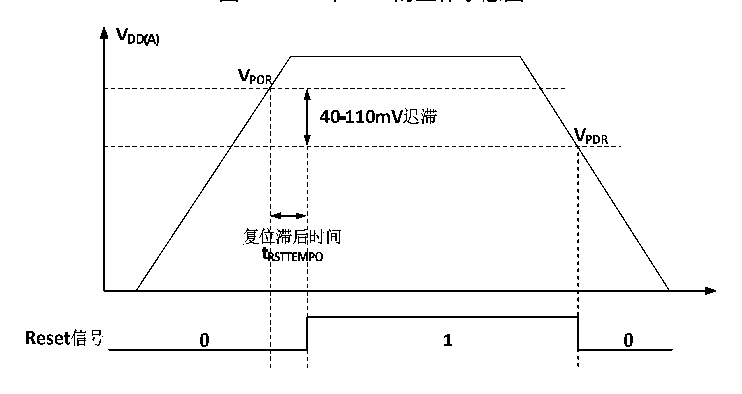
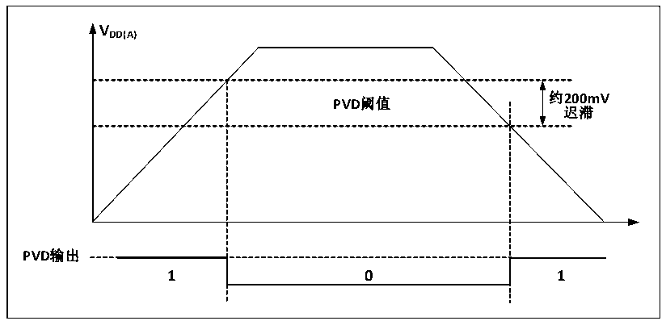

<!-- source-page: 9 -->

[← p.8](0008.md) · [index](../README.md) · [PDF p.9](https://ch32-riscv-ug.github.io/CH32V103/datasheet_zh/CH32xRM.PDF#page=9) · [p.10 →](0010.md)

<!-- header: CH32x103应用手册 https://wch.cn -->

## 2.2 电源管理

### 2.2.1 上电复位和掉电复位

系统内部集成了上电复位POR和掉电复位PDR电路，当芯片供电电压VDD 和VDDA 低于对应门限电压  
时，系统被相关电路复位，无需外置额外的复位电路。上电门限电压 VPOR 和掉电门限电压 VPDR 的参数  
请参考对应的数据手册。  

图2-2 POR和PDR的工作示意图  
 <!-- rendered from the PDF; verify at https://ch32-riscv-ug.github.io/CH32V103/datasheet_zh/CH32xRM.PDF#page=9 -->

🖼 Text parsed from the figure above

<!-- image: p9-draw-image-00002 inside the figure -->
<!-- image: p9-draw-image-00004 inside the figure -->
<!-- image: p9-draw-image-00006 inside the figure -->
<!-- image: p9-draw-image-00003 inside the figure -->
<!-- image: p9-draw-image-00005 inside the figure -->
<!-- image: p9-draw-image-00007 inside the figure -->
<!-- image: p9-draw-image-00008 inside the figure -->
<!-- image: p9-draw-image-00015 inside the figure -->
<!-- image: p9-draw-image-00011 inside the figure -->
<!-- image: p9-draw-image-00013 inside the figure -->
<!-- image: p9-draw-image-00014 inside the figure -->
<!-- image: p9-draw-image-00012 inside the figure -->
<!-- image: p9-draw-image-00009 inside the figure -->
<!-- image: p9-draw-image-00010 inside the figure -->
<!-- image: p9-draw-image-00016 inside the figure -->
<!-- image: p9-draw-image-00017 inside the figure -->
<!-- image: p9-draw-image-00018 inside the figure -->
<!-- image: p9-draw-image-00020 inside the figure -->
<!-- image: p9-draw-image-00019 inside the figure -->
<!-- image: p9-draw-image-00021 inside the figure -->
<!-- image: p9-draw-image-00023 inside the figure -->
<!-- image: p9-draw-image-00022 inside the figure -->

### 2.2.2 可编程电压监测器

可编程电压监测器 PVD，主要被用于监控系统主电源的变化，与电源控制寄存器 PWR_CTLR 的  
PLS[2:0]所设置的门槛电压相比较，配合外部中断寄存器（EXTI）设置，可产生相关中断，以便及时  
通知系统进行数据保存等掉电前操作。  
具体配置如下：  
1） 设置PWR_CTLR寄存器的PLS[2:0]域，选择要监测电压阈值。  
2） 可选的中断处理。PVD功能内部连接EXTI模块的第16线的上升/下降边沿触发设置，开启此中断  
（配置EXTI），当VDD 下降到PVD阈值以下或上升到PVD阈值之上时就会产生PVD中断。  
3） 设置PWR_CTLR寄存器的PVDE位来开启PVD功能。  
4） 读取 PWR_CSR 状态寄存器的 PVD0 位可获取当前系统主电源与 PLS[2:0]设置阈值关系，执行相应  
软处理。当VDD电压高于PLS[2:0]设置阈值，PVD0位置0；当VDD电压低于PLS[2:0]设置阈值，  
PVD0位置1。  

图2-3 PVD的工作示意图  
 <!-- rendered from the PDF; verify at https://ch32-riscv-ug.github.io/CH32V103/datasheet_zh/CH32xRM.PDF#page=9 -->

🖼 Text parsed from the figure above

<strong>VDD(A)</strong>  
PVD阈值  0  
<strong>约200mV</strong>  
<strong>迟滞</strong>  
<strong>PVD输出</strong>  

<!-- image: p9-draw-image-00001 bbox=[507.84, 786.48, 527.52, 797.04] -->
<!-- footer: V2.0 7 -->
