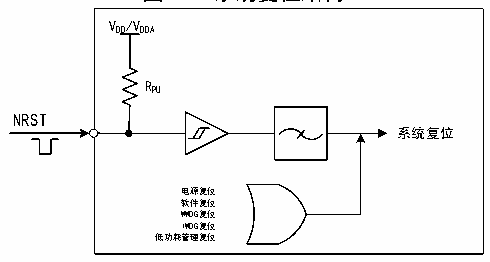
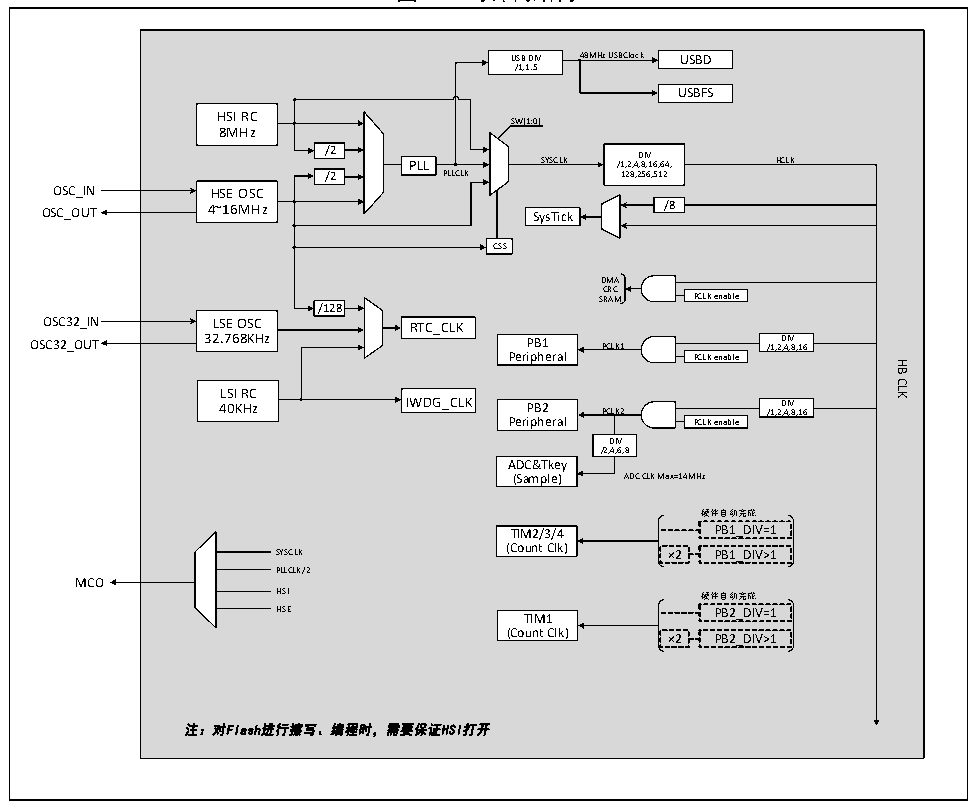

<!-- source-page: 15 -->

[← p.14](0014.md) · [index](../README.md) · [PDF p.15](https://ch32-riscv-ug.github.io/CH32V103/datasheet_zh/CH32xRM.PDF#page=15) · [p.16 →](0016.md)

<!-- header: CH32x103应用手册 https://wch.cn -->

图3-1 系统复位结构  
 <!-- rendered from the PDF; verify at https://ch32-riscv-ug.github.io/CH32V103/datasheet_zh/CH32xRM.PDF#page=15 -->

🖼 Text parsed from the figure above

VDD/VDDA  
RPU  
NRST  
系统复位  
电源复位  
软件复位  
WWDG复位  
IWDG复位  
低功耗管理复位  

### 3.2.3 后备区域复位

后备区域复位发生时，只会复位后备区域寄存器，包括后备寄存器、RCC_BDCTLR寄存器（RTC使  
能和LSE振荡器）。其产生条件包括：  
● 在VDD 和VBAT 都掉电的前提下，由VDD 或VBAT 上电引起  
● RCC_BDCTLR寄存器的BDRST位置1  

## 3.3 时钟

### 3.3.1 系统时钟结构

图3-2 时钟树结构  
 <!-- rendered from the PDF; verify at https://ch32-riscv-ug.github.io/CH32V103/datasheet_zh/CH32xRM.PDF#page=15 -->

🖼 Text parsed from the figure above

USB DIV 48MHz USBClock USBD  
/1,1.5  
USBFS  
HSI RC  
SW[1:0]  
8MHz  
/2  
PLL SYSCLK /1,2,4 D ,8 IV ,16,64,  
HCLK  
/2 PLLCLK 128,256,512  
HSE OSC4~16MHz  
OSC_OUT 4~16MHz SysTick /8  
CSS  
DMA  
CRC  
SRAM PCLK enable  
/128  
LSE OSC32.768KHz  
OSC32_OUT 32.768KHz PB1 PCLK1 /1,2 D ,4 IV ,8,16  
Peripheral PCLK enable  
HB  
CLK  
LSI RC  
40KHz IWDG_CLK PB2 PCLK2 /1,2 D ,4 IV ,8,16  
Peripheral PCLK enable  
DIV  
/2,4,6,8  
ADC&amp;Tkey  
(Sample) ADC CLK Max=14MHz  
硬件自动完成  
TIM2/3/4 PB1_DIV=1  
(Count Clk)  
SYSCLK ×2 PB1_DIV&gt;1  
PLLCLK/2  
MCO  
HSI 硬件自动完成  
HSE TIM1 PB2_DIV=1  
(Count Clk) ×2 PB2_DIV&gt;1  
注：对Flash进行擦写、编程时，需要保证HSI打开  

<!-- image: p15-draw-image-00001 bbox=[507.84, 786.48, 527.52, 797.04] -->
<!-- footer: V2.0 13 -->
