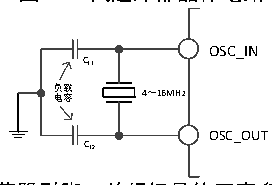
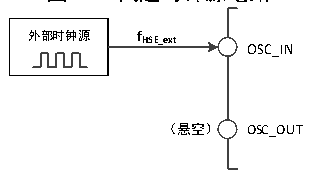

<!-- source-page: 16 -->

[← p.15](0015.md) · [index](../README.md) · [PDF p.16](https://ch32-riscv-ug.github.io/CH32V103/datasheet_zh/CH32xRM.PDF#page=16) · [p.17 →](0017.md)

<!-- header: CH32x103应用手册 https://wch.cn -->

### 3.3.2 高速时钟（HSI/HSE）

HSI是系统内部8MHz的RC振荡器产生的高速时钟信号。HSI RC振荡器能够在不需要任何外部器  
件的条件下提供系统时钟。它的启动时间很短但时钟频率精度较差。HSI 通过设置 RCC_CTLR 寄存器  
中的HSION位被启动和关闭，HSIRDY位指示HSI RC振荡器是否稳定。系统默认HSION和HSIRDY置1  
（建议不要关闭）。如果设置了RCC_INTR寄存器的HSIRDYIE位，将产生相应中断。  
● 出厂校准：制造工艺的差异会导致每个芯片的 RC 振荡频率不同，所以在芯片出厂前，会为每颗  
芯片进行HSI校准。系统复位后，工厂校准值被装载到RCC_CTLR寄存器的HSICAL[7:0]中。  
● 用户调整：基于不同的电压或环境温度，应用程序可以通过RCC_CTLR寄存器里的HSITRIM[4:0]  
位来调整HSI频率。  
注：如果HSE晶体振荡器失效，HSI时钟会被作为备用时钟源（时钟安全系统）。  
HSE是外部的高速时钟信号，包括外部晶体/陶瓷谐振器产生或者外部高速时钟送入。  
● 外部晶体/陶瓷谐振器（HSE晶体）：外接4-16MHz外部振荡器为系统提供更为精确的时钟源。进  
一步信息可参考数据手册的电气特性部分。HSE晶体可以通过设置RCC_CTLR寄存器中的HSEON位  
被启动和关闭，HSERDY位指示HSE晶体振荡是否稳定，硬件在HSERDY位置1后才将时钟送入系  
统。如果设置了RCC_INTR寄存器的HSERDYIE位，将产生相应中断。  

图3-3 高速外部晶体电路  
 <!-- rendered from the PDF; verify at https://ch32-riscv-ug.github.io/CH32V103/datasheet_zh/CH32xRM.PDF#page=16 -->

🖼 Text parsed from the figure above

OSC_IN  
CL1  
负 电 载 容 4～16MHz  
OSC_OUT  
CL2  

注：负载电容需要尽可能地靠近振荡器引脚，并根据晶体厂家参数选择容值。  
● 外部高速时钟源（HSE旁路）：此模式从外部直接送入时钟源到OSC_IN引脚，OSC_OUT引脚悬空。  
最高支持25MHz频率。应用程序需在HSEON位为0情况下，置位HSEBYP位，打开HSE旁路功能，  
然后再置位HSEON位。  

图3-4 高速时钟源电路  
 <!-- rendered from the PDF; verify at https://ch32-riscv-ug.github.io/CH32V103/datasheet_zh/CH32xRM.PDF#page=16 -->

🖼 Text parsed from the figure above

<strong>外部时钟源 fHSE_ext</strong>  
OSC_IN  
（悬空） OSC_OUT  

### 3.3.3 低速时钟（LSI/LSE）

LSI 是系统内部约 40KHz 的 RC 振荡器产生的低速时钟信号。它可以在停机和待机模式下保持运  
行，为RTC时钟、独立看门狗和唤醒单元提供时钟基准。进一步信息可参考数据手册的电气特性部分。  
LSI可以通过设置RCC_RSTSCKR寄存器中的LSION位被启动和关闭，然后通过查询LSIRDY位检测LSI  
RC振荡是否稳定，硬件在LSIRDY位置 1后才将时钟送入。如果设置了 RCC_INTR寄存器的 LSIRDYIE  
位，将产生相应中断。  
LSE是外部的低速时钟信号，包括外部晶体/陶瓷谐振器产生或者外部低速时钟送入。它为RTC时  
钟或者其他定时功能提供一个低功耗且精确的时钟源。  
● 外部晶体/陶瓷谐振器（LSE晶体）：外接32.768KHz的外部低速振荡器。LSE通过设置RCC_BDCTLR  
寄存器中的LSEON位被启动和关闭，LSERDY位指示LSE晶体振荡是否稳定，硬件在LSERDY位置  
1后才将时钟送入系统。如果设置了RCC_INTR寄存器的LSERDYIE位，将产生相应中断。  
<!-- image: p16-draw-image-00001 bbox=[507.84, 786.48, 527.52, 797.04] -->
<!-- footer: V2.0 14 -->
