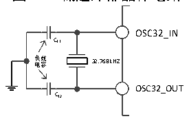
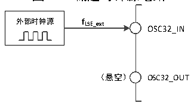

<!-- source-page: 17 -->

[← p.16](0016.md) · [index](../README.md) · [PDF p.17](https://ch32-riscv-ug.github.io/CH32V103/datasheet_zh/CH32xRM.PDF#page=17) · [p.18 →](0018.md)

<!-- header: CH32x103应用手册 https://wch.cn -->

图3-5 低速外部晶体电路  
 <!-- rendered from the PDF; verify at https://ch32-riscv-ug.github.io/CH32V103/datasheet_zh/CH32xRM.PDF#page=17 -->

🖼 Text parsed from the figure above

OSC32_IN  
CL1  
负 电 载 容 32.768kHZ  
OSC32_OUT  
CL2  

● 外部低速时钟源（LSE旁路）：此模式从外部直接送入时钟源到OSC32_IN引脚，OSC32_OUT引脚  
悬空。应用程序需在LSEON位为0情况下，置位LSEBYP位，打开LSE旁路功能，然后再置位LSEON  
位。  

图3-6 低速时钟源电路  
 <!-- rendered from the PDF; verify at https://ch32-riscv-ug.github.io/CH32V103/datasheet_zh/CH32xRM.PDF#page=17 -->

🖼 Text parsed from the figure above

<strong>外部时钟源 fLSE_ext</strong>  
OSC32_IN  
（悬空） OSC32_OUT  

### 3.3.4 PLL 时钟

通过配置RCC_CFGR0寄存器和扩展寄存器EXTEN_CTR，内部PLL时钟可以选择4种时钟来源和倍  
频系数，这些设置必须在PLL被开启前完成，一旦PLL被启动，这些参数就不能被改动。设置RCC_CTLR  
寄存器中的PLLON位被启动和关闭，PLLRDY位指示PLL时钟是否稳定，硬件在PLLRDY位置1后才将  
时钟送入系统。如果设置了RCC_INTR寄存器的PLLRDYIE位，将产生相应中断。  
如果需要在应用中使用 USBD 或 USBFS 模块功能，PLL 必须被设置为输出 48MHz 或 72MHz 时钟，  
用于提供48MHz的USBCLK时钟。因为USBD或USBFS模块的模拟收发时钟基于PLL时钟。  
PLL时钟来源：  
● HSI时钟送入  
● HSI经过2分频送入  
● HSE时钟送入  
● HSE经过2分频送入  

### 3.3.5 总线/外设时钟

#### 3.3.5.1 系统时钟（SYSCLK）

通过配置RCC_CFGR0寄存器SW[1:0]位配置系统时钟来源，SWS[1:0]指示当前的系统时钟源。  
● HSI作为系统时钟  
● HSE作为系统时钟  
● PLL时钟作为系统时钟  
控制器复位后，默认HSI时钟被选为系统时钟源。时钟源之间的切换必须在目标时钟源准备就绪  
后才会发生。  

#### 3.3.5.2 HB/PB1/PB2 总线外设时钟（HCLK/PCLK1/PCLK2）

通过配置RCC_CFGR0寄存器的HPRE[3:0]、PPRE1[2:0]、PPRE2[2:0]位，可以分别配置HB、PB1、  
PB2总线的时钟。这些总线时钟决定了挂载在其下面的外设接口访问时钟基准。应用程序可以调整不  
同的数值，来降低部分外设工作时的功耗。  
通过 RCC_AHBRSTR、RCC_APB1PRSTR、RCC_APB2PRSTR 寄存器中各个位可以复位不同的外设模块，  
将其恢复到初始状态。  
通过 RCC_AHBPCENR、RCC_APB1PCENR、RCC_APB2PCENR 寄存器中各个位可以单独开启或关闭不同  
外设模块通讯时钟接口。使用某个外设时，首先需要开启其时钟使能位，才能访问其寄存器。  
<!-- image: p17-draw-image-00001 bbox=[507.84, 786.48, 527.52, 797.04] -->
<!-- footer: V2.0 15 -->
