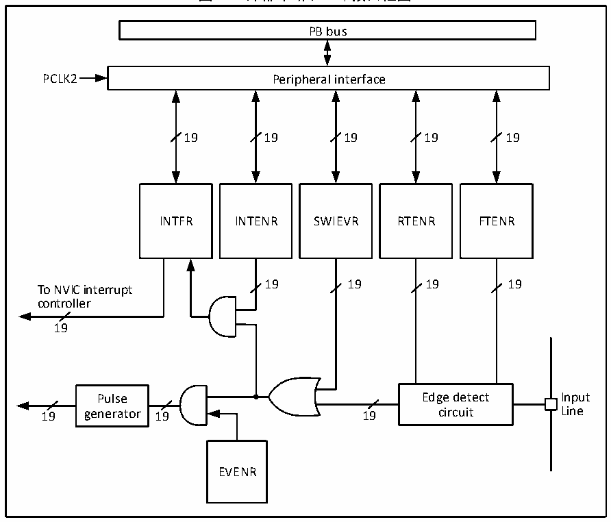

<!-- source-page: 52 -->

[← p.51](0051.md) · [index](../README.md) · [PDF p.52](https://ch32-riscv-ug.github.io/CH32V103/datasheet_zh/CH32xRM.PDF#page=52) · [p.53 →](0053.md)

<!-- header: CH32x103应用手册 https://wch.cn -->

> ⬆ **Table continued** — rendered in full at [page 51](0051.md). <!-- p52-table-001 -->

## 9.4 外部中断和事件控制器（EXTI）

### 9.4.1 概述

图9-1 外部中断(EXTI)接口框图  
 <!-- rendered from the PDF; verify at https://ch32-riscv-ug.github.io/CH32V103/datasheet_zh/CH32xRM.PDF#page=52 -->

🖼 Text parsed from the figure above

PB bus  
PCLK2 Peripheral interface  
19 19 19 19 19  
INTFR INTENR SWIEVR RTENR FTENR  
19 19 19 19  
To NVIC interrupt  
controller  
19  
Pulse Edge detect Input  
19 generator 19 19 circuit Line  
EVENR  

由图9-1可以看出，外部中断的触发源既可以是软件中断（SWIEVR）也可以是实际的外部中断通  
<!-- image: p52-draw-image-00001 bbox=[507.84, 786.48, 527.52, 797.04] -->
<!-- footer: V2.0 50 -->
