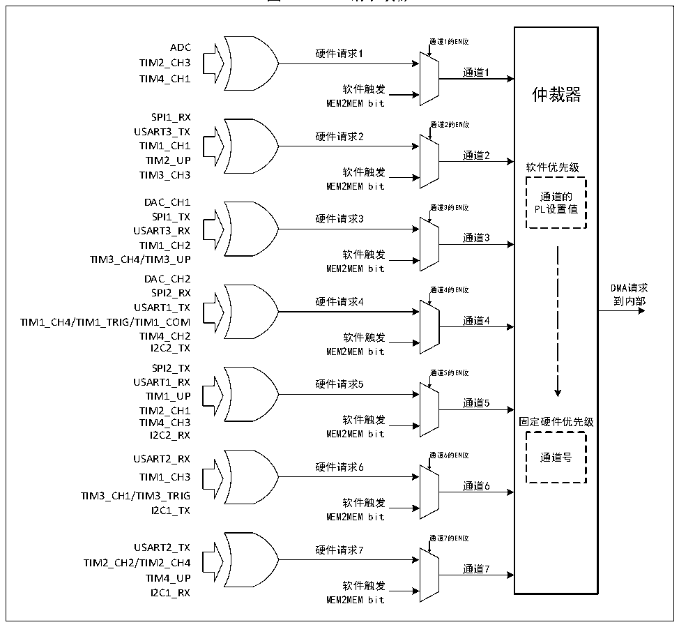

<!-- source-page: 89 -->

[← p.88](0088.md) · [index](../README.md) · [PDF p.89](https://ch32-riscv-ug.github.io/CH32V103/datasheet_zh/CH32xRM.PDF#page=89) · [p.90 →](0090.md)

<!-- header: CH32x103应用手册 https://wch.cn -->

### 11.2.3 DMA 请求映射

DMA控制器提供7个通道，每个通道对应多个外设请求，通过设置相应外设寄存器中对应DMA控  
制位，可以独立的开启或关闭各个外设的DMA功能。  

图11-2 DMA请求映像  
 <!-- rendered from the PDF; verify at https://ch32-riscv-ug.github.io/CH32V103/datasheet_zh/CH32xRM.PDF#page=89 -->

🖼 Text parsed from the figure above

ADC 通道1的EN位  
硬件请求1  
TIM2_CH3  
通道1  
TIM4_CH1  
软件触发 仲裁器  
MEM2MEM bit  
SPI1_RX  
通道2的EN位  
USART3_TX 硬件请求2  
TIM1_CH1  
通道2  
TIM2_UP  
软件优先级  
TIM3_CH3 软件触发  
MEM2MEM bit  
通道的  
DAC_CH1  
通道3的EN位 PL设置值  
SPI1_TX 硬件请求3  
USART3_RX  
通道3  
TIM1_CH2  
软件触发  
TIM3_CH4/TIM3_UP  
MEM2MEM bit  
DAC_CH2  
SPI2_RX 通道4的EN位 DMA请求  
硬件请求4 到内部  
USART1_TX  
TIM1_CH4/TIM1_TRIG/TIM1_COM 通道4  
TIM4_CH2 软件触发  
I2C2_TX MEM2MEM bit  
SPI2_TX  
通道5的EN位  
USART1_RX 硬件请求5  
TIM1_UP  
通道5  
TIM2_CH1  
TIM4_CH3 软件触发 固定硬件优先级  
I2C2_RX MEM2MEM bit  
USART2_RX 通道6的EN位 通道号  
硬件请求6  
TIM1_CH3  
通道6  
TIM3_CH1/TIM3_TRIG  
软件触发  
I2C1_TX  
MEM2MEM bit  
通道7的EN位  
USART2_TX 硬件请求7  
TIM2_CH2/TIM2_CH4  
通道7  
TIM4_UP  
软件触发  
I2C1_RX  
MEM2MEM bit  

<!-- p89-table-001 (table-11-2@1) pages 89-90 -->
<table><caption>表11-2 DMA各通道外设映射表</caption><tr><th>外设</th><th>通道1</th><th>通道2</th><th>通道3</th><th>通道4</th><th>通道5</th><th>通道6</th><th>通道7</th></tr><tr><td>ADC</td><td>ADC</td><td></td><td></td><td></td><td></td><td></td><td></td></tr><tr><td>DAC</td><td></td><td></td><td>DAC_CH1</td><td>DAC_CH2</td><td></td><td></td><td></td></tr><tr><td>SPIx</td><td></td><td>SPI1_RX</td><td>SPI1_TX</td><td>SPI2_RX</td><td>SPI2_TX</td><td></td><td></td></tr><tr><td>USARTx</td><td></td><td>USART3_TX</td><td>USART3_RX</td><td>USART1_TX</td><td>USART1_RX</td><td>USART2_RX</td><td>USART2_TX</td></tr><tr><td>TIM1</td><td></td><td>TIM1_CH1</td><td>TIM1_CH2</td><td style="text-align:left">TIM1_CH4TIM1_TRIGTIM1_COM</td><td>TIM1_UP</td><td>TIM1_CH3</td><td></td></tr><tr><td>TIM2</td><td>TIM2_CH3</td><td>TIM2_UP</td><td></td><td></td><td>TIM2_CH1</td><td></td><td style="text-align:left">TIM2_CH2TIM2_CH4</td></tr><tr><td>TIM3</td><td></td><td>TIM3_CH3</td><td style="text-align:left">TIM3_CH4TIM3_UP</td><td></td><td></td><td style="text-align:left">TIM3_CH1TIM3_TRIG</td><td></td></tr><tr><td>TIM4</td><td>TIM4_CH1</td><td></td><td></td><td>TIM4_CH2</td><td>TIM4_CH3</td><td></td><td>TIM4_UP</td></tr><tr><td>I2Cx</td><td></td><td></td><td></td><td>I2C2_TX</td><td>I2C2_RX</td><td>I2C1_TX</td><td>I2C1_RX</td></tr></table>

<!-- image: p89-draw-image-00001 bbox=[507.84, 786.48, 527.52, 797.04] -->
<!-- footer: V2.0 87 -->
