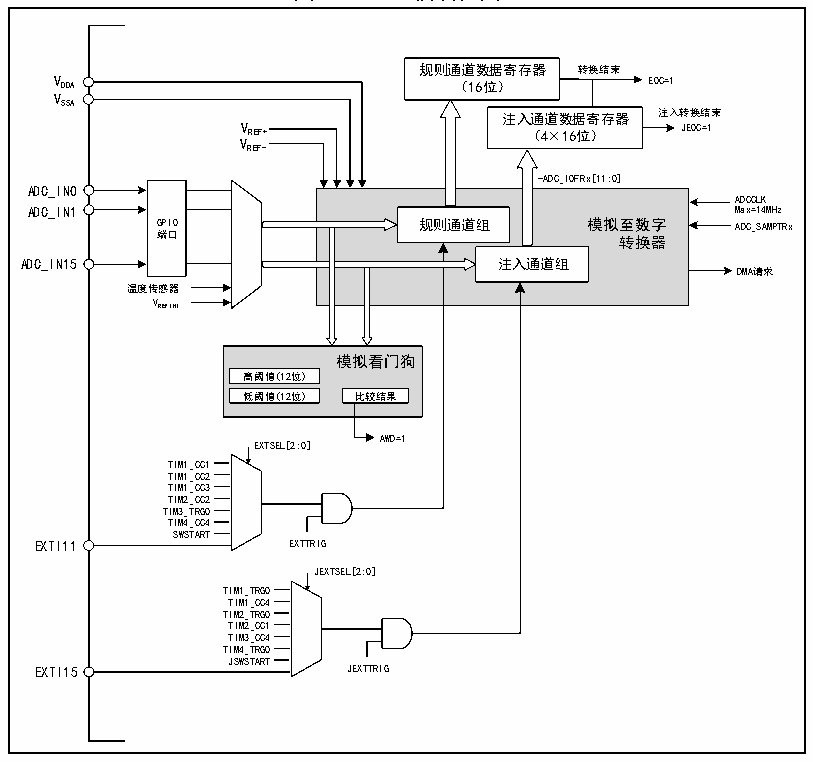

<!-- source-page: 95 -->

[← p.94](0094.md) · [index](../README.md) · [PDF p.95](https://ch32-riscv-ug.github.io/CH32V103/datasheet_zh/CH32xRM.PDF#page=95) · [p.96 →](0096.md)

<!-- header: CH32x103应用手册 https://wch.cn -->

# 第 12 章 模拟/数字转换（ADC）

本章模块描述适用于CH32F103和CH32V103微控制器全系列产品。  
ADC模块包含一个12位的逐次逼近型的模拟数字转换器，最高14MHz的输入时钟。支持16个  
外部通道和2个内部信号源采样源。可完成通道的单次转换、连续转换，通道间自动扫描模式、间  
断模式、外部触发模式等功能。可以通过模拟看门狗功能监测通道电压是否在阈值范围内。  

## 12.1 主要特性

● 12位分辨率  
● 支持16个外部通道和2个内部信号源采样  
● 多通道的多种采样转换方式：单次、连续、扫描、触发、间断等  
● 数据对齐模式：左对齐、右对齐  
● 采样时间可按通道分别编程  
● 规则转换和注入转换均支持外部触发  
● 模拟看门狗监测通道电压  
● ADC通道输入范围：0≤V ≤V  
IN DDA  

## 12.2 功能描述

### 12.2.1 模块结构

图12-1 ADC模块框图  
 <!-- rendered from the PDF; verify at https://ch32-riscv-ug.github.io/CH32V103/datasheet_zh/CH32xRM.PDF#page=95 -->

🖼 Text parsed from the figure above

规则通道数据寄存器 转换结束  
V DDA （16位） EOC=1  
VSSA  
注入通道数据寄存器 注入转换结束  
V REF+ （4×16位） JEOC=1  
VREF-  
-ADC_IOFRx[11:0]  
GPIO端口  
ADC_IN0  
规则通道组 模拟至数字转换器注入通道组  
ADCCLK  
ADC_IN15 注入通道组  
DMA请求  
温度传感器  
VREFINT  
模拟看门狗  
高阈值(12位)  
低阈值(12位) 比较结果  
AWD=1  
EXTSEL[2:0]  
TIM1_CC1  
TIM1_CC2  
TIM1_CC3  
TIM2_CC2  
TIM3_TRGO  
TIM4_CC4  
SWSTART  
EXTI11 EXTTRIG  
JEXTSEL[2:0]  
TIM1_TRGO  
TIM1_CC4  
TIM2_TRGO  
TIM2_CC1  
TIM3_CC4  
TIM4_TRGO  
JSWSTART  
EXTI15 JEXTTRIG  

<!-- image: p95-draw-image-00001 bbox=[507.84, 786.48, 527.52, 797.04] -->
<!-- footer: V2.0 93 -->
