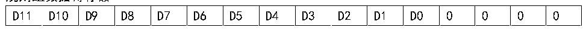
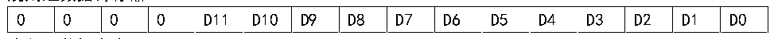

<!-- source-page: 97 -->

[← p.96](0096.md) · [index](../README.md) · [PDF p.97](https://ch32-riscv-ug.github.io/CH32V103/datasheet_zh/CH32xRM.PDF#page=97) · [p.98 →](0098.md)

<!-- header: CH32x103应用手册 https://wch.cn -->
6）数据对齐  
ADC_CTLR2寄存器中的ALIGN位选择ADC转换后的数据存储对齐方式。12位数据支持左对齐和右  
对齐模式。  
规则组通道的数据寄存器ADC_RDATAR保存的是实际转换的12位数字值；而注入组通道的数据寄  
存器ADC_IDATARx是实际转换的数据减去ADC_IOFRx寄存器的定义的偏移量后写入的值，会存在正负  
情况，所以有符号位（SIGNB）。  

图12-2 数据左对齐  
 <!-- rendered from the PDF; verify at https://ch32-riscv-ug.github.io/CH32V103/datasheet_zh/CH32xRM.PDF#page=97 -->

规则组数据寄存器  

🖼 Text parsed from the figure above

D11  D10  D9  D8  D7  D6  D5  D4  D3  D2  D1  D0  0  0  0  0  

注入组数据寄存器  

<!-- p97-table-002 (table-11-3@1) -->
<table><tr><th>SIGNB</th><th>D11</th><th>D10</th><th>D9</th><th>D8</th><th>D7</th><th>D6</th><th>D5</th><th>D4</th><th>D3</th><th>D2</th><th>D1</th><th>D0</th><th>0</th><th>0</th><th>0</th></tr></table>

图12-3 数据右对齐  
 <!-- rendered from the PDF; verify at https://ch32-riscv-ug.github.io/CH32V103/datasheet_zh/CH32xRM.PDF#page=97 -->

规则组数据寄存器  

🖼 Text parsed from the figure above

0  0  0  0  D11  D10  D9  D8  D7  D6  D5  D4  D3  D2  D1  D0  

注入组数据寄存器  

<!-- p97-table-004 (table-11-3@1) -->
<table><tr><th>SIGNB</th><th>SIGNB</th><th>SIGNB</th><th>SIGNB</th><th>D11</th><th>D10</th><th>D9</th><th>D8</th><th>D7</th><th>D6</th><th>D5</th><th>D4</th><th>D3</th><th>D2</th><th>D1</th><th>D0</th></tr></table>

### 12.2.3 外部触发源

ADC转换的启动事件可以由外部事件触发。如果设置了ADC_CTLR2寄存器的EXTTRIG或JEXTTRIG  
位，则可分别通过外部事件触发规则组或注入组通道的转换。此时，EXTSEL[2:0]和JEXTSEL[2:0]位  
的配置决定规则组和注入组的外部事件源。  
注：当外部触发信号被选为ADC规则或注入转换时，只有它的上升沿可以启动转换。  

<!-- p97-table-005 (table-12-1@1) -->
<table><caption>表12-1 规则组通道的外部触发源</caption><tr><th>EXTSEL[2:0]</th><th>触发源</th><th>类型</th></tr><tr><td>000</td><td>定时器1的CC1事件</td><td rowspan="6">来自片上定时器的内部信号</td></tr><tr><td>001</td><td>定时器1的CC2事件</td></tr><tr><td>010</td><td>定时器1的CC3事件</td></tr><tr><td>011</td><td>定时器2的CC2事件</td></tr><tr><td>100</td><td>定时器3的TRGO事件</td></tr><tr><td>101</td><td>定时器4的CC4事件</td></tr><tr><td>110</td><td>EXTI线11</td><td>来自外部引脚</td></tr><tr><td>111</td><td>SWSTART位置1软件触发</td><td>软件控制位</td></tr></table>

<!-- p97-table-006 (table-12-2@1) -->
<table><caption>表12-2注入组通道的外部触发源</caption><tr><th>JEXTSEL[2:0]</th><th>触发源</th><th>类型</th></tr><tr><td>000</td><td>定时器1的TRGO事件</td><td rowspan="6">来自片上定时器的内部信号</td></tr><tr><td>001</td><td>定时器1的CC4事件</td></tr><tr><td>010</td><td>定时器2的TRGO事件</td></tr><tr><td>011</td><td>定时器2的CC1事件</td></tr><tr><td>100</td><td>定时器3的CC4事件</td></tr><tr><td>101</td><td>定时器4的TRGO事件</td></tr><tr><td>110</td><td>EXTI线15</td><td>来自外部引脚</td></tr><tr><td>111</td><td>JSWSTART位置1软件触发</td><td>软件控制位</td></tr></table>

<!-- image: p97-draw-image-00001 bbox=[507.84, 786.48, 527.52, 797.04] -->
<!-- footer: V2.0 95 -->
