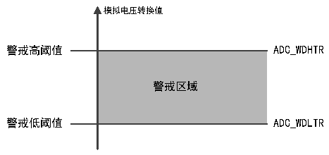

<!-- source-page: 100 -->

[← p.99](0099.md) · [index](../README.md) · [PDF p.100](https://ch32-riscv-ug.github.io/CH32V103/datasheet_zh/CH32xRM.PDF#page=100) · [p.101 →](0101.md)

<!-- header: CH32x103应用手册 https://wch.cn -->
4）连续转换  
在连续转换模式中，当前面ADC转换一结束马上就启动另一次转换，转换不会在选择组的最后一  
个通道上停止，而是再次从选择组的第一个通道继续转换。此模式的启动事件包括外部触发事件和  
ADON位置1，设置启动后，需将CONT位置1。  
如果一个规则通道被转换，转换数据被存储于ADC_RDATAR寄存器中，转换结束标志EOC被置位，  
如果设置了EOCIE，则产生中断。  
如果一个注入通道被转换，转换数据被存储于 ADC_IDATARx 寄存器中，注入转换结束标志 JEOC  
被置位，如果设置了JEOCIE，则产生中断。  

### 12.2.5 模拟看门狗

如果被ADC转换的模拟电压低于低阈值或高于高阈值，AWD模拟看门狗状态位被设置。阈值设  
置位于ADC_WDHTR和ADC_WDLTR寄存器的最低12个有效位中。通过设置ADC_CTLR1寄存器的AWDIE  
位以允许产生相应中断。  

图12-4 模拟看门狗阈值区  
 <!-- rendered from the PDF; verify at https://ch32-riscv-ug.github.io/CH32V103/datasheet_zh/CH32xRM.PDF#page=100 -->

🖼 Text parsed from the figure above

模拟电压转换值  
警戒高阈值 ADC_WDHTR  
<!-- image: p100-draw-image-00002 inside the figure -->
警戒区域  
警戒低阈值 ADC_WDLTR  

配置ADC_CTLR1寄存器的AWDSGL、AWDEN、JAWDEN及AWDCH[4:0]位选择模拟看门狗警戒的通  
道，具体关系见下表：  

<!-- p100-table-001 (table-12-4@1) -->
<table><caption>表12-4 模拟看门狗通道选择</caption><tr><th rowspan="2">模拟看门狗警戒通道</th><th colspan="4">ADC_CTLR1寄存器控制位</th></tr><tr><td>AWDSGL</td><td>AWDEN</td><td>JAWDEN</td><td>AWDCH[4:0]</td></tr><tr><td>不警戒</td><td>忽略</td><td>0</td><td>0</td><td>忽略</td></tr><tr><td>所有注入通道</td><td>0</td><td>0</td><td>1</td><td>忽略</td></tr><tr><td>所有规则通道</td><td>0</td><td>1</td><td>0</td><td>忽略</td></tr><tr><td>所有注入和规则通道</td><td>0</td><td>1</td><td>1</td><td>忽略</td></tr><tr><td>单一注入通道</td><td>1</td><td>0</td><td>1</td><td>决定通道编号</td></tr><tr><td>单一规则通道</td><td>1</td><td>1</td><td>0</td><td>决定通道编号</td></tr><tr><td>单一注入和规则通道</td><td>1</td><td>1</td><td>1</td><td>决定通道编号</td></tr></table>

### 12.2.6 温度传感器

芯片内置温度传感器，连接ADC_INT16通道，通过ADC将传感器输出的电压转换成数字值来反  
馈芯片内部温度，推荐设置采样时间是17.1us。温度传感器输出的电压随温度线性变化，由于制造  
离散性，其线性变化的曲线斜率和偏移有所不同，所以内部温度传感器更适合于检测温度的变化，  
而不是测量绝对的温度。如果需要测量精确的温度，应该使用一个外置的温度传感器。  
通过设置ADC_CTLR2寄存器的TSVREFE位置1，唤醒ADC内部采样通道，软件启动或者外部触  
发启动ADC的温度传感器通道转换，读取数据结果（mV）。其中，数字值和温度(℃)换算公式如  
下：  
温度(℃) = ((VSENSE-V25)/Avg_Slope)+25  
V25：温度传感器在25℃下的电压值  
<!-- image: p100-draw-image-00001 bbox=[507.84, 786.48, 527.52, 797.04] -->
<!-- footer: V2.0 98 -->
