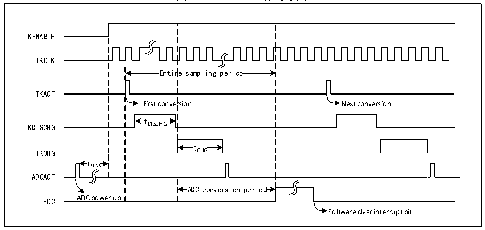

<!-- source-page: 110 -->

[← p.109](0109.md) · [index](../README.md) · [PDF p.110](https://ch32-riscv-ug.github.io/CH32V103/datasheet_zh/CH32xRM.PDF#page=110) · [p.111 →](0111.md)

<!-- header: CH32x103应用手册 https://wch.cn -->

# 第 13 章 触摸按键检测（TKEY）

本章模块描述适用于CH32F103和CH32V103微控制器全系列产品。  
CH32F103系列产品触摸检测控制（TKEY_F）单元，借助ADC模块的电压转换功能，通过将电容量  
转换为电压量进行采样，实现触摸按键检测功能。检测通道复用 ADC 的 16 个外部通道，通过 ADC 模  
块的单次转换模式实现触摸按键检测。  
CH32V103系列产品触摸检测控制（TKEY_V）单元，通过将电容量变化转变为频率变化进行采样，  
实现触摸按键检测功能。检测通道复用 ADC 的 16 路外部通道。应用程序通过数字值的变化量判断触  
摸按键状态。  

## 13.1 TKEY_F 功能描述

● TKEY_F开启  
TKEY_F检测过程需要ADC模块配合进行，所以使用TKEY_F功能时，需要保证ADC模块处于上  
电状态（ADON=1），然后将ADC_CTLR1寄存器的TKENABLE位置1，打开TKEY_F单元功能。  
TKEY_F只支持单次单通道转换模式，将待转换的通道配置到ADC模块的规则组序列第一个，软  
件启动转换（写TKEY_ACT寄存器）。  
注：不进行TKEY_F转换时，仍然可以保留ADC通道配置转换功能。  

图13-1 TKEY_F工作时序图  
 <!-- rendered from the PDF; verify at https://ch32-riscv-ug.github.io/CH32V103/datasheet_zh/CH32xRM.PDF#page=110 -->

🖼 Text parsed from the figure above

TKENABLE  
TKCLK  
Entir  re sampling period  Entir  re sampling period  
TKACT  
First conversion Next conversion  
t DISCHG  tDISCHG  
TKDISCHG DISCHG  
t CHG  tCHG  
TKCHG CHG  
t  tSTAB  
ADCACT  
ADC conversion period  
EOC ADC power up  
Software clear interrupt bit  

● 可编程采样时间  
TKEY单元转换需要先使用若干个系统时钟周期（tDISCHG）进行放电，然后再通过若干个ADCCLK  
周期（tCHG）对通道进行充电进行电压采样，充电周期数通过 TKEY_CHARGE1 和 TKEY_CHARGE2 寄存  
器中的TKCGx[2:0]位更改，每个通道可以分别用不同的充电周期来调整采样电压。  
总流程转换时间如下计算：  
TTKCONV= 放电周期数（TSYSCLK）+ 充电周期数（TADCCLK）+ 13.5TADCCLK  

## 13.2 TKEY_F 操作步骤

TKEY_F检测属于ADC模块下的扩展功能，其工作原理是通过“触摸”和“非触摸”方式让硬件通  
道感知的电容量发生变化，进而通过可设置的充放电周期数将电容量的变化转换为电压的变化，最后  
通过ADC模块转换为数字值。  
<!-- image: p110-draw-image-00001 bbox=[507.84, 786.48, 527.52, 797.04] -->
<!-- footer: V2.0 108 -->
