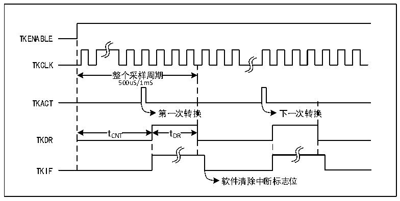

<!-- source-page: 113 -->

[← p.112](0112.md) · [index](../README.md) · [PDF p.113](https://ch32-riscv-ug.github.io/CH32V103/datasheet_zh/CH32xRM.PDF#page=113) · [p.114 →](0114.md)

<!-- header: CH32x103应用手册 https://wch.cn -->

> ⬆ **Table continued** — rendered in full at [page 112](0112.md). <!-- p113-table-001 -->

### 13.3.5 TKEY_F 数据寄存器（TKEY_F_DR）

偏移地址：0x4C  

<!-- p113-line-00008-bitfield (p113-line-00008-bitfield) -->
<table class="bitfield"><colgroup><col style="width:6.2500%"><col style="width:6.2500%"><col style="width:6.2500%"><col style="width:6.2500%"><col style="width:6.2500%"><col style="width:6.2500%"><col style="width:6.2500%"><col style="width:6.2500%"><col style="width:6.2500%"><col style="width:6.2500%"><col style="width:6.2500%"><col style="width:6.2500%"><col style="width:6.2500%"><col style="width:6.2500%"><col style="width:6.2500%"><col style="width:6.2500%"></colgroup><tr><th>31</th><th>30</th><th>29</th><th>28</th><th>27</th><th>26</th><th>25</th><th>24</th><th>23</th><th>22</th><th>21</th><th>20</th><th>19</th><th>18</th><th>17</th><th>16</th></tr><tr><td colspan="16">Reserved</td></tr></table>

<!-- p113-line-00010-bitfield (p113-line-00010-bitfield) -->
<table class="bitfield"><colgroup><col style="width:6.2500%"><col style="width:6.2500%"><col style="width:6.2500%"><col style="width:6.2500%"><col style="width:6.2500%"><col style="width:6.2500%"><col style="width:6.2500%"><col style="width:6.2500%"><col style="width:6.2500%"><col style="width:6.2500%"><col style="width:6.2500%"><col style="width:6.2500%"><col style="width:6.2500%"><col style="width:6.2500%"><col style="width:6.2500%"><col style="width:6.2500%"></colgroup><tr><th>15</th><th>14</th><th>13</th><th>12</th><th>11</th><th>10</th><th>9</th><th>8</th><th>7</th><th>6</th><th>5</th><th>4</th><th>3</th><th>2</th><th>1</th><th>0</th></tr><tr><td colspan="16">DATA[15:0]</td></tr></table>

<!-- p113-table-002 (table-13-1@1) -->
<table><tr><th>位</th><th>名称</th><th>访问</th><th>描述</th><th>复位值</th></tr><tr><td>[31:16]</td><td>Reserved</td><td>RO</td><td>保留。</td><td>0</td></tr><tr><td>[15:0]</td><td>DATA[15:0]</td><td>RO</td><td>转换的数据。</td><td>0</td></tr></table>

注：此寄存器映射ADC模块的规则数据寄存器（ADC_RDATAR）。  

## 13.4 TKEY_V 功能描述

● TKEY_V开启  
TKEY_V单元检测内部复用了ADC模块的通道选择及部分寄存器地址，所用使用TKEY_V功能需要  
开启ADC模块（ADON=1），并打开ADC时钟以此来访问相关寄存器。然后将TKEY_V_CTLR（ADC_CTLR1）  
寄存器的TKENABLE位置1，打开TKEY_V单元功能。  
注：因为共用了采样通道选择，所以ADC和TKEY_V检测功能不能同时使用。  
● 工作原理  
一旦开启了 TKEY_V 功能，硬件内部将自动进行周期性地采样计数转换过程，并在完成一次转换  
后，通知应用代码在固定时间（tDR）内取走数据，开启下一次转换，此循环过程在 TKEY_V 开启下是  
自动进行的。如图13-2所示，硬件内部会提供了用来计数的脉冲源TKCLK，应用软件选择当前硬件计  
数周期为 500us 或 1ms，当内部完成周期内的计数统计后，会产生 TKIF 标志通知应用代码读取本次  
转换数值，应用代码需要在最长43uS（tDR）内取走数据，否则下一轮的转换将影响数据寄存器的内容。  

图13-2 TKEY_V工作时序图  
 <!-- rendered from the PDF; verify at https://ch32-riscv-ug.github.io/CH32V103/datasheet_zh/CH32xRM.PDF#page=113 -->

🖼 Text parsed from the figure above

TKENABLE  
TKCLK  
整个采样周期  整个采样周期500uS/1mS  
500uS/1mS  
TKACT  
第一次转换 下一次转换  
t CNT  tCNT  
t DR  tDR  
t t  
TKIF  
软件清除中断标志位  

<!-- image: p113-draw-image-00001 bbox=[507.84, 786.48, 527.52, 797.04] -->
<!-- footer: V2.0 111 -->
