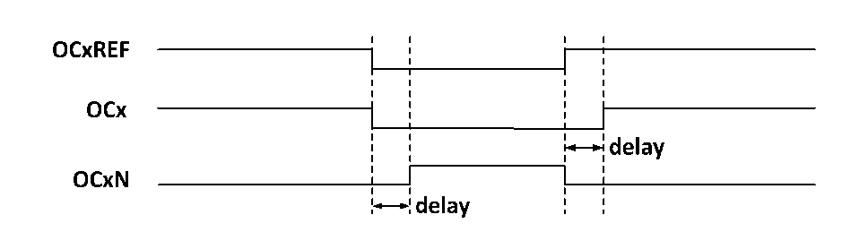

<!-- source-page: 124 -->

[← p.123](0123.md) · [index](../README.md) · [PDF p.124](https://ch32-riscv-ug.github.io/CH32V103/datasheet_zh/CH32xRM.PDF#page=124) · [p.125 →](0125.md)

<!-- header: CH32x103应用手册 https://wch.cn -->
的上升沿相当于 OCxREF 有一个延迟，OCxN 与 OCxREF 相反，它的上升沿相对参考信号的下降沿会有  
一个延迟，如果延迟大于有效输出宽度，则不会产生相应的脉冲。  
如图14-4展示了OCx和OCxN与OCxREF的关系，并展示出死区。  

图14-4 互补输出和死区  
 <!-- rendered from the PDF; verify at https://ch32-riscv-ug.github.io/CH32V103/datasheet_zh/CH32xRM.PDF#page=124 -->

🖼 Text parsed from the figure above

<!-- image: p124-draw-image-00002 inside the figure -->
<!-- image: p124-draw-image-00003 inside the figure -->
<!-- image: p124-draw-image-00006 inside the figure -->
<!-- image: p124-draw-image-00004 inside the figure -->
<!-- image: p124-draw-image-00005 inside the figure -->

### 14.3.7 刹车信号

当产生刹车信号时，输出使能信号和无效电平都会根据MOE、OIS、OISN、OSSI和OSSR等位进行  
修改。但 OCx 和 OCxN 不会在任何时间都处在有效电平。刹车事件源可以来自于刹车输入引脚，也可  
以是一个时钟失败事件，而时钟失败事件由CSS（时钟安全系统）产生。  
在系统复位后，刹车功能被默认禁止（MOE位为低），置BKE位可以使能刹车功能，输入的刹车  
信号的极性可以通过设置BKP设置，BKE和BKP信号可以被同时写入，在真正写入之前会有一个PB时  
钟的延迟，因此需要等一个PB周期才能正确读出写入值。  
在刹车引脚出现选定的电平系统将产生如下动作：  
1）MOE位被异步清零，根据SOOI位的设置将输出置为无效状态、空闲状态或者复位状态；  
2）在MOE被清零后，每一个输出通道输出由OISx确定的电平；  
3）当使用互补输出时：输出被置于无效状态，具体取决于极性；  
4）如果BIE被置位，当BIF置位，会产生一个中断；如果设置了BDE位，则会产生一个DMA请求；  
5）如果AOE被置位，在下一个更新事件UEV时，MOE位被自动置位。  

### 14.3.8 单脉冲模式

单脉冲模式可以用于让微控制器响应一个特定的事件，使之在一个延迟之后产生一个脉冲，延迟  
和脉冲的宽度可编程。置 OPM 位可以使核心计数器在产生下一个更新事件 UEV 时（计数器翻转到 0）  
停止。  
如图14-4，需要在TI2输入引脚上检测到一个上升沿开始，延迟Tdelay之后，在OC1上产生一  
个长度为Tpulse的正脉冲：  
<!-- image: p124-draw-image-00001 bbox=[507.84, 786.48, 527.52, 797.04] -->
<!-- footer: V2.0 122 -->
