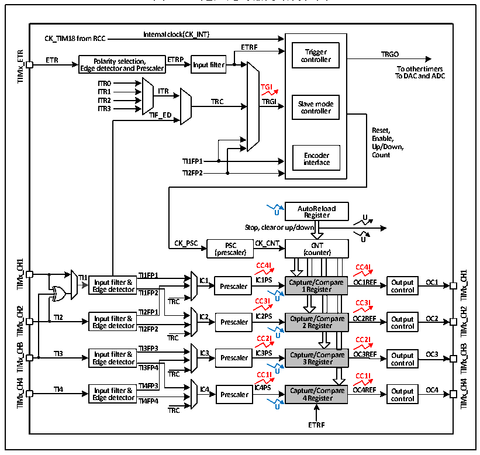

<!-- source-page: 143 -->

[← p.142](0142.md) · [index](../README.md) · [PDF p.143](https://ch32-riscv-ug.github.io/CH32V103/datasheet_zh/CH32xRM.PDF#page=143) · [p.144 →](0144.md)

<!-- header: CH32x103应用手册 https://wch.cn -->

# 第 15 章 通用定时器（GPTM）

本章模块描述适用于CH32F103和CH32V103微控制器全系列产品。  
通用定时器模块包含一个 16 位可自动重装的定时器，用于测量脉冲宽度或者产生特定频率的脉  
冲、PWM波等。可用于自动化控制、电源等领域。  

## 15.1 主要特征

通用定时器的主要特征包括：  
● 16位自动重装计数器，支持增计数模式，减计数模式和增减计数模式  
● 16位预分频器，分频系数从1～65536之间动态可调  
● 支持四路独立的比较捕获通道  
● 每路比较捕获通道支持多种工作模式，比如：输入捕获、输出比较、PWM生成和单脉冲输  
出  
● 支持外部信号控制定时器  
● 支持在多种模式下使用DMA  
● 支持增量式编码，定时器之间的级联和同步  

## 15.2 原理和结构

图15-1 通用定时器的结构框图  
 <!-- rendered from the PDF; verify at https://ch32-riscv-ug.github.io/CH32V103/datasheet_zh/CH32xRM.PDF#page=143 -->

🖼 Text parsed from the figure above

<strong>Internal clock(CK_INT)</strong>  
<strong>CK_TIM18 from RCC</strong>  
<strong>ETRF</strong>  
<strong>Trigger TRGO</strong>  
<!-- image: p143-draw-image-00004 inside the figure -->
<strong>ETR Polarity selection, ETRP Input filter controller</strong>  
<!-- image: p143-draw-image-00003 inside the figure -->
<strong>Edge detector and Prescaler To other timers</strong>  
<!-- image: p143-draw-image-00002 inside the figure -->
<strong>To DAC and ADC</strong>  
<strong>ITR0 TGI</strong>  
<strong>ITR1 ITR</strong>  
<strong>ITR2 TRC TRGI Slave mode</strong>  
<strong>ITR3 controller</strong>  
<strong>TIF_ED</strong>  
<strong>Reset,</strong>  
<strong>Enable,</strong>  
<strong>Up/Down,</strong>  
<strong>Encoder Count</strong>  
<strong>TI1FP1 interface</strong>  
<strong>TI2FP2</strong>  
<strong>AutoReload</strong>  
<strong>U Register U</strong>  
<strong>Stop, clear or up/down</strong>  
<strong>U</strong>  
<strong>CK_PSC PSC CK_CNT CNT</strong>  
<strong>(prescaler) (counter)</strong>  
<!-- image: p143-draw-image-00024 inside the figure -->
<strong>CC4I CC4I</strong>  
<!-- image: p143-draw-image-00023 inside the figure -->
<!-- image: p143-draw-image-00008 inside the figure -->
<!-- image: p143-draw-image-00022 inside the figure -->
<strong>TI1 Input filter &amp; TTII11FFPP11 IC1 IICC11PPSS Capture/Compare OC1REF Output OC1</strong>  
<!-- image: p143-draw-image-00007 inside the figure -->
<!-- image: p143-draw-image-00021 inside the figure -->
Input filter &amp; Edge detector  TI1FP1  
<!-- image: p143-draw-image-00006 inside the figure -->
<strong>Edge detector TI1FP2 Prescaler 1 Register control</strong>  
<!-- image: p143-draw-image-00005 inside the figure -->
<strong>TRC CC3I U CC3I</strong>  
<!-- image: p143-draw-image-00028 inside the figure -->
<!-- image: p143-draw-image-00012 inside the figure -->
<strong>TI2FP1</strong>  
<!-- image: p143-draw-image-00027 inside the figure -->
<!-- image: p143-draw-image-00011 inside the figure -->
<strong>TI2 E In d p ge u t d f e il t t e e c r t &amp; or TI2FP2 IC2 Prescaler IC2PS Capt 2 u R re e / g C is o t m er pare OC2REF O co u n t t p r u o t l OC2</strong>  
<!-- image: p143-draw-image-00026 inside the figure -->
<!-- image: p143-draw-image-00010 inside the figure -->
<!-- image: p143-draw-image-00025 inside the figure -->
<!-- image: p143-draw-image-00009 inside the figure -->
<strong>TRC CC2I U CC2I</strong>  
<!-- image: p143-draw-image-00032 inside the figure -->
<!-- image: p143-draw-image-00016 inside the figure -->
<strong>TI3FP3</strong>  
<!-- image: p143-draw-image-00031 inside the figure -->
<!-- image: p143-draw-image-00015 inside the figure -->
<strong>TI3 Input filter &amp; IC3 Prescaler IC3PS Capture/Compare OC3REF Output OC3</strong>  
<!-- image: p143-draw-image-00030 inside the figure -->
<!-- image: p143-draw-image-00014 inside the figure -->
<!-- image: p143-draw-image-00029 inside the figure -->
<strong>Edge detector 3 Register control</strong>  
<!-- image: p143-draw-image-00013 inside the figure -->
<strong>TI3FP4</strong>  
<strong>TRC CC1IU CC1I</strong>  
<!-- image: p143-draw-image-00036 inside the figure -->
<!-- image: p143-draw-image-00020 inside the figure -->
<!-- image: p143-draw-image-00035 inside the figure -->
<strong>TI4 E In d p ge u t d f e il t t e e c r t &amp; or T T I I 4 4 F F P P 4 3 IC4 Prescaler IC4PS Capt 4 u R re e / g C is o t m er pare OC4REF O co u n t t p r u o t l OC4</strong>  
<!-- image: p143-draw-image-00019 inside the figure -->
<!-- image: p143-draw-image-00034 inside the figure -->
<!-- image: p143-draw-image-00018 inside the figure -->
<!-- image: p143-draw-image-00033 inside the figure -->
<!-- image: p143-draw-image-00017 inside the figure -->
<strong>TRC U</strong>  
<strong>ETRF</strong>  

<!-- image: p143-draw-image-00001 bbox=[507.84, 786.48, 527.52, 797.04] -->
<!-- footer: V2.0 141 -->
