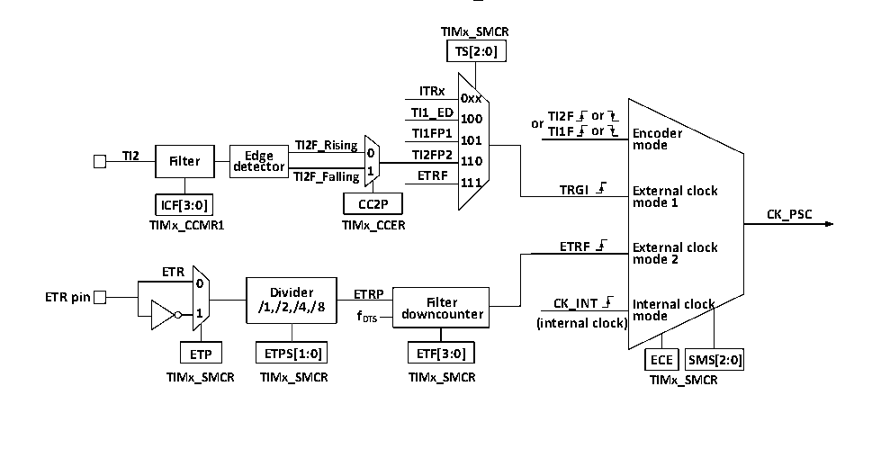

<!-- source-page: 144 -->

[← p.143](0143.md) · [index](../README.md) · [PDF p.144](https://ch32-riscv-ug.github.io/CH32V103/datasheet_zh/CH32xRM.PDF#page=144) · [p.145 →](0145.md)

<!-- header: CH32x103应用手册 https://wch.cn -->

### 15.2.1 概述

如图 15-1 所示，通用定时器的结构大致可以分为三部分，即输入时钟部分，核心计数器部分和  
比较捕获通道部分。  
通用定时器的时钟可以来自于HB总线时钟（CK_INT），可以来自外部时钟输入引脚（TIMx_ETR），  
可以来自于其他具有时钟输出功能的定时器（ITRx），还可以来自于比较捕获通道的输入端（TIMx_CHx）。  
这些输入的时钟信号经过各种设定的滤波分频等操作后成为 CK_PSC 时钟，输出给核心计数器部分。  
另外，这些复杂的时钟来源还可以作为TRGO输出给其他的定时器、ADC和DAC等外设。  
通用定时器的核心是一个16位计数器（CNT）。CK_PSC经过预分频器（PSC）分频后，成为CK_CNT  
再最终输给 CNT，CNT 支持增计数模式、减计数模式和增减计数模式，并有一个自动重装值寄存器  
（ATRLR）在每个计数周期结束后为CNT重装载初始化值。  
通用定时器拥有四组比较捕获通道，每组比较捕获通道都可以从专属的引脚上输入脉冲，也可以  
向引脚输出波形，即比较捕获通道支持输入和输出模式。比较捕获寄存器每个通道的输入都支持滤波、  
分频、边沿检测等操作，并支持通道间的互触发，还能为核心计数器CNT提供时钟。每个比较捕获通  
道都拥有一组比较捕获寄存器（CHxCVR），支持与主计数器（CNT）进行比较而输出脉冲。  

### 15.2.2 通用定时器和高级定时器的区别

与高级定时器相比，通用定时器缺少以下功能：  
1）通用定时器缺少对核心计数器的计数周期进行计数的重复计数寄存器。  
2）通用定时器的比较捕获通道缺少死区产生，没有互补输出。  
3）通用定时器没有刹车信号机制。  
4）通用定时器的默认时钟CK_INT都来自PB1，而高级定时器（TIM1）的CK_INT来自PB2。  

### 15.2.3 时钟输入

本节论述CK_PSC的来源。此处截取通用定时器的整体结构框图的时钟源部分。  

图15-2 通用定时器CK_PSC来源框图  
 <!-- rendered from the PDF; verify at https://ch32-riscv-ug.github.io/CH32V103/datasheet_zh/CH32xRM.PDF#page=144 -->

🖼 Text parsed from the figure above

<strong>TIMx_SMCR</strong>  
<strong>TS[2:0]</strong>  
<strong>ITRx</strong>  
<strong>0xx</strong>  
<strong>TI1_ED 100 or TI2F or</strong>  
<strong>TI1FP1 TI1F or Encoder</strong>  
<strong>TI2F_Rising 101 mode</strong>  
<strong>TI2 Filter de E t d e g c e tor TI2F_Falling 0 1 T E I2 T F R P F 2 110</strong>  
<strong>111</strong>  
<strong>TRGI External clock</strong>  
<strong>ICF[3:0] CC2P mode 1</strong>  
<strong>CK_PSC</strong>  
<strong>TIMx_CCMR1 TIMx_CCER</strong>  
<strong>ETRF External clock</strong>  
<strong>mode 2</strong>  
<strong>ETR</strong>  
<strong>0</strong>  
<strong>ETR pin /1 D ,/ i 2 vi , d /4 e , r /8 ETRP Filter CK_INT Internal clock</strong>  
<strong>1 fDTS downcounter</strong>  
<strong>mode</strong>  
<strong>(internal clock)</strong>  
<strong>ETP ETPS[1:0] ETF[3:0] ECE SMS[2:0]</strong>  
<strong>TIMx_SMCR TIMx_SMCR TIMx_SMCR TIMx_SMCR</strong>  

可选的输入时钟可以分为4类：  
1）外部时钟引脚（ETR）输入的路线：ETR→ETRP→ETRF；  
2）内部PB时钟输入路线：CK_INT；  
3）来自比较捕获通道引脚（TIMx_CHx）的路线：TIMx_CHx→TIx→TIxFPx，此路线也用于编码器模式；  
4）来自内部其他定时器的输入：ITRx。  
<!-- image: p144-draw-image-00001 bbox=[507.84, 786.48, 527.52, 797.04] -->
<!-- footer: V2.0 142 -->
