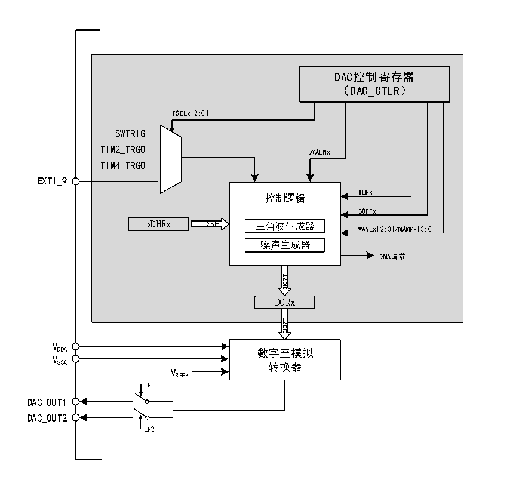

<!-- source-page: 166 -->

[← p.165](0165.md) · [index](../README.md) · [PDF p.166](https://ch32-riscv-ug.github.io/CH32V103/datasheet_zh/CH32xRM.PDF#page=166) · [p.167 →](0167.md)

<!-- header: CH32x103应用手册 https://wch.cn -->

# 第 16 章 数字/模拟转换（DAC）

本章模块描述仅适用于CH32F103微控制器全系列产品。  
数字/模拟转换模块（DAC），包含 1 个 12位数字输入转换 2路模拟电压输出的转换器。内置三  
角波、噪声波形发生器，支持多种事件触发转换，DMA功能等。  

## 16.1 主要特性

● 1个DAC转换器对应2个通道单调输出  
● 三角波、噪声波形发生器  
● 12位数据左对齐或者右对齐  
● 支持DMA功能  
● 多种触发事件  

## 16.2 功能描述

### 16.2.1 DAC 模块结构

图16-1 DAC模块框图  
 <!-- rendered from the PDF; verify at https://ch32-riscv-ug.github.io/CH32V103/datasheet_zh/CH32xRM.PDF#page=166 -->

🖼 Text parsed from the figure above

DAC控制寄存器  
（DAC_CTLR）  
TSELx[2:0]  
SWTRIG  
TIM2_TRGO  
DMAENx  
TIM4_TRGO  
EXTI_9  
TENx  
控制逻辑  
BOFFx  
xDHRx 12bit 三角波生成器  
WAVEx[2:0]/MAMPx[3:0]  
噪声生成器  
DMA请求  
12bit  
DORx  
12bit  
VDDA  
数字至模拟  
VSSA  
转换器  
VREF+  
EN1  
DAC_OUT1  
DAC_OUT2  
EN2  

### 16.2.2 DAC 通道配置

1）开启DAC功能：将DAC_CTLR寄存器的ENx位置1，即可打开对DAC通道x的模拟供电。经  
过一段启动时间，DAC通道x即被使能。DAC包含2个模拟输出通道，当同时使能（EN1位为1，EN2  
<!-- image: p166-draw-image-00001 bbox=[507.84, 786.48, 527.52, 797.04] -->
<!-- footer: V2.0 164 -->
