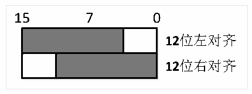

<!-- source-page: 167 -->

[← p.166](0166.md) · [index](../README.md) · [PDF p.167](https://ch32-riscv-ug.github.io/CH32V103/datasheet_zh/CH32xRM.PDF#page=167) · [p.168 →](0168.md)

<!-- header: CH32x103应用手册 https://wch.cn -->
为1）2个通道的输出，将以通道1的配置输出相同波形到2个模拟通道上；当只使能1号通道的输  
出，将以1号通道配置输出波形到1号模拟通道上，2号通道不输出；当只使能2号通道的输出，  
将以2号通道配置输出波形到2号模拟通道上，1号通道不输出。  
注：为了避免寄生的干扰和额外的功耗，DAC通道对应的引脚需提前设置成模拟输入(AIN)模式。  
2）打开输出缓冲：DAC集成了输出缓冲，可以用来减少输出阻抗，增加驱动能力直接驱动外部  
负载。每个DAC通道输出缓存可以通过设置DAC_CTLR寄存器的BOFFx位来使能或者关闭。  
3）数据格式：包括12位数据左对齐和12位数据右对齐。写入数据到DAC_R12BDHRx[11:0]，  
模块将加载（1个PB1时钟周期后）右对齐数据到数据输出寄存器DAC_DORx[11:0]；写入数据到  
DAC_L12BDHRx[15:3]，模块经过相应的移位后，将加载（1个PB1时钟周期后）左对齐数据到数据  
输出寄存器DAC_DORx[11:0]。  

图16-2 数据格式  
 <!-- rendered from the PDF; verify at https://ch32-riscv-ug.github.io/CH32V103/datasheet_zh/CH32xRM.PDF#page=167 -->

🖼 Text parsed from the figure above

15 7 0  
<!-- image: p167-draw-image-00002 inside the figure -->
<!-- image: p167-draw-image-00003 inside the figure -->
12位左对齐  
<!-- image: p167-draw-image-00004 inside the figure -->
<!-- image: p167-draw-image-00005 inside the figure -->
12位右对齐  

4）DMA功能：DAC通道具有DMA功能。设置DAC_CTLR寄存器的DMAENx位为1，开启对应通道  
的DMA功能。当有触发事件(不包括软件触发)发生，则产生一个DMA请求，然后DAC_DORx寄存器的  
数据将被更新。  
5）触发事件选择：DAC转换可以由以下4种事件触发进行转换。当配置DAC_CTLR寄存器的  
TENx位为1，配置TSELx[2:0]控制位选择4个触发事件之一触发DAC转换。  

<!-- p167-table-002 (table-16-1@1) -->
<table><caption>表16-1 触发事件</caption><tr><th>触发源</th><th>类型</th><th>TSELx[2:0]</th></tr><tr><td>定时器3 TRGO事件</td><td rowspan="3">来自片上定时器内部信号</td><td>001</td></tr><tr><td>定时器2 TRGO事件</td><td>100</td></tr><tr><td>定时器4 TRGO事件</td><td>101</td></tr><tr><td>EXTI线路9</td><td>外部引脚</td><td>110</td></tr><tr><td>SWTRIG（软件触发）</td><td>软件控制位</td><td>111</td></tr></table>

DAC接口会监测到来自选中的定时器TRGO输出或者外部中断线9的上升沿，在触发后的3个  
PB1时钟周期后，将寄存器DAC_DORx更新为新值。  
如果配置的是软件触发方式，SWTRIG位一旦置1，将会启动一次转换，在触发后的1个PB1时  
钟周期后，将寄存器DAC_DORx更新为新值，并且硬件对SWTRIG位自动清0。  
注：不能在ENx为1时改变TSELx[2:0]位。  

### 16.2.3 DAC 转换

DAC通道的数据来自DAC_DORx寄存器，但不能直接对寄存器DAC_DORx写入数据，任何输出到  
DAC通道x的数据都必须写入DAC_R12BDHR1、DAC_L12BDHR1、DAC_R12BDHR2、DAC_L12BDHR2寄存器  
中。由系统内部的保持寄存器DAC_DHRx会获取上述寄存器值将其经过相应时间送入DAC_DORx寄存  
器。  
非触发方式下，写入寄存器DAC_xDHRx的数据会在1个PB1时钟周期后移入DAC_DORx寄存器。  
软件触发下，事件触发上升沿后1个PB1时钟周期后自动更新DAC_DORx寄存器。  
硬件触发（定时器TRGO事件或者外部中断线9上升沿）下，触发事件后3个PB1时钟周期后自  
动更新DAC_DORx寄存器。  
<!-- image: p167-draw-image-00001 bbox=[507.84, 786.48, 527.52, 797.04] -->
<!-- footer: V2.0 165 -->
