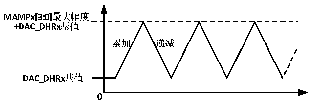
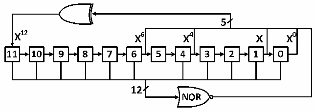

<!-- source-page: 168 -->

[← p.167](0167.md) · [index](../README.md) · [PDF p.168](https://ch32-riscv-ug.github.io/CH32V103/datasheet_zh/CH32xRM.PDF#page=168) · [p.169 →](0169.md)

<!-- header: CH32x103应用手册 https://wch.cn -->
装入DAC_DORx寄存器数据，在经过时间tSETTLING 之后，输出即有效，这段时间的长短依电源电压  
和模拟输出负载的不同会有所变化。  
数字输入经过DAC被线性地转换为模拟电压输出，其范围为0到VDDA。任一DAC通道引脚上的输  
出电压满足下面的关系：  
DAC输出电压 = VDDA* (DAC_DORx/ 4096)。  

### 16.2.4 DAC 三角波生成器

模块内置了一个三角波生成器，可以在基准信号上加上一个小幅度的三角波。设置WAVEx[1:0]  
位为‘10’选择DAC的三角波生成功能。设置DAC_CTLR寄存器的MAMPx[3:0]位来选择三角波的幅  
度。  
系统内部包含一个从0开始的三角波计数器，在每次触发事件后3个PB1时钟周期后累加1。  
计数器的值与DAC_DHRx寄存器的数值相加并丢弃溢出位后写入DAC_DORx寄存器。在传入DAC_DORx  
寄存器的数值小于MAMPx[3:0]位定义的最大幅度时，三角波计数器逐步累加，一旦达到设置的最大  
幅度，则计数器开始递减，达到0后再开始累加，周而复始。将WAVEx[1:0]位置‘00’，可以复位  
三角波的生成。  
注：1.为了产生三角波，必须使能DAC触发，即设DAC_CTLR寄存器的TENx位为1。  
2.MAMPx[3:0]位必须在使能DAC之前设置，否则其值不能修改。  

图16-3 三角波生成  
 <!-- rendered from the PDF; verify at https://ch32-riscv-ug.github.io/CH32V103/datasheet_zh/CH32xRM.PDF#page=168 -->

🖼 Text parsed from the figure above

<!-- image: p168-draw-image-00008 inside the figure -->
<!-- image: p168-draw-image-00003 inside the figure -->
<!-- image: p168-draw-image-00007 inside the figure -->
<!-- image: p168-draw-image-00004 inside the figure -->
<!-- image: p168-draw-image-00006 inside the figure -->
<!-- image: p168-draw-image-00002 inside the figure -->
<!-- image: p168-draw-image-00005 inside the figure -->
<!-- image: p168-draw-image-00013 inside the figure -->
<!-- image: p168-draw-image-00010 inside the figure -->
<!-- image: p168-draw-image-00012 inside the figure -->
<!-- image: p168-draw-image-00009 inside the figure -->
<!-- image: p168-draw-image-00011 inside the figure -->
<!-- image: p168-draw-image-00018 inside the figure -->
<!-- image: p168-draw-image-00019 inside the figure -->
<!-- image: p168-draw-image-00017 inside the figure -->
<!-- image: p168-draw-image-00014 inside the figure -->
<!-- image: p168-draw-image-00016 inside the figure -->
<!-- image: p168-draw-image-00015 inside the figure -->
<!-- image: p168-draw-image-00020 inside the figure -->

### 16.2.5 DAC 噪声生成器

模块内置了一个噪声生成器，是利用线性反馈移位寄存器(Linear Feedback Shift Register  
LFSR)产生幅度变化的伪噪声。设置WAVE[1:0]位为‘01’选择DAC噪声生成功能。设置DAC_CTLR  
寄存器的MAMPx[3:0]位来选择屏蔽部分LFSR的数据。  
寄存器LFSR的预装入值为0xAAA。按照特定算法，在每次触发事件后3个PB1时钟周期之后更  
新该寄存器的值。设置DAC_CR寄存器的MAMPx[3:0]位可以屏蔽部分或者全部LFSR的数据，这样的  
得到的LSFR值与DAC_DHRx的数值相加，去掉溢出位之后即被写入DAC_DORx寄存器。如果寄存器  
LFSR值为0x000，则会注入‘1’(防锁定机制)。将WAVEx[1:0]位置‘00’，可以复位LFSR波形的  
生成算法。  
注意：1.为了产生噪声，必须使能DAC触发，即设DAC_CTLR寄存器的TENx位为1。  

图16-4 LFSR寄存器算法  
 <!-- rendered from the PDF; verify at https://ch32-riscv-ug.github.io/CH32V103/datasheet_zh/CH32xRM.PDF#page=168 -->

🖼 Text parsed from the figure above

<!-- image: p168-draw-image-00058 inside the figure -->
<!-- image: p168-draw-image-00055 inside the figure -->
<!-- image: p168-draw-image-00046 inside the figure -->
<!-- image: p168-draw-image-00048 inside the figure -->
<!-- image: p168-draw-image-00053 inside the figure -->
<!-- image: p168-draw-image-00050 inside the figure -->
<!-- image: p168-draw-image-00045 inside the figure -->
<!-- image: p168-draw-image-00047 inside the figure -->
<!-- image: p168-draw-image-00049 inside the figure -->
<!-- image: p168-draw-image-00051 inside the figure -->
<!-- image: p168-draw-image-00052 inside the figure -->
<!-- image: p168-draw-image-00037 inside the figure -->
<!-- image: p168-draw-image-00035 inside the figure -->
<!-- image: p168-draw-image-00021 inside the figure -->
<!-- image: p168-draw-image-00023 inside the figure -->
<!-- image: p168-draw-image-00025 inside the figure -->
<!-- image: p168-draw-image-00027 inside the figure -->
<!-- image: p168-draw-image-00029 inside the figure -->
<!-- image: p168-draw-image-00031 inside the figure -->
<!-- image: p168-draw-image-00033 inside the figure -->
<!-- image: p168-draw-image-00039 inside the figure -->
<!-- image: p168-draw-image-00041 inside the figure -->
<!-- image: p168-draw-image-00043 inside the figure -->
<!-- image: p168-draw-image-00036 inside the figure -->
<!-- image: p168-draw-image-00022 inside the figure -->
<!-- image: p168-draw-image-00024 inside the figure -->
<!-- image: p168-draw-image-00028 inside the figure -->
<!-- image: p168-draw-image-00034 inside the figure -->
<!-- image: p168-draw-image-00040 inside the figure -->
<!-- image: p168-draw-image-00044 inside the figure -->
<!-- image: p168-draw-image-00038 inside the figure -->
<!-- image: p168-draw-image-00026 inside the figure -->
<!-- image: p168-draw-image-00030 inside the figure -->
<!-- image: p168-draw-image-00032 inside the figure -->
<!-- image: p168-draw-image-00042 inside the figure -->
<!-- image: p168-draw-image-00054 inside the figure -->
<!-- image: p168-draw-image-00057 inside the figure -->
<!-- image: p168-draw-image-00056 inside the figure -->

<!-- image: p168-draw-image-00001 bbox=[507.84, 786.48, 527.52, 797.04] -->
<!-- footer: V2.0 166 -->
