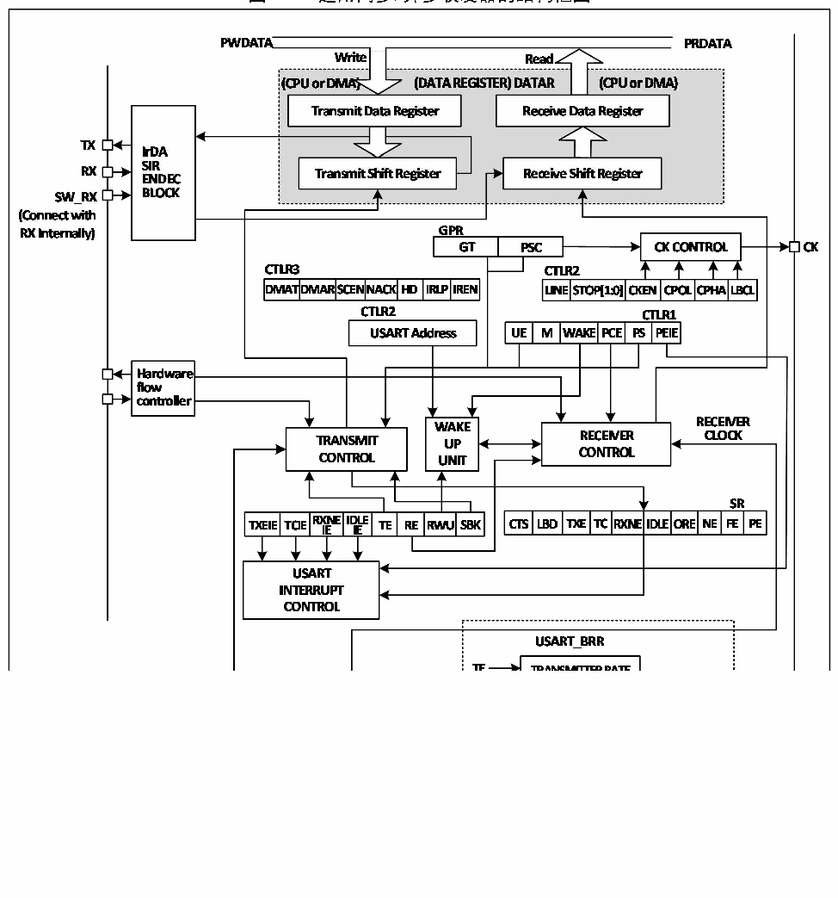

<!-- source-page: 175 -->

[← p.174](0174.md) · [index](../README.md) · [PDF p.175](https://ch32-riscv-ug.github.io/CH32V103/datasheet_zh/CH32xRM.PDF#page=175) · [p.176 →](0176.md)

<!-- header: CH32x103应用手册 https://wch.cn -->

## 17.2 概述

图17-1 通用同步/异步收发器的结构框图  
 <!-- rendered from the PDF; verify at https://ch32-riscv-ug.github.io/CH32V103/datasheet_zh/CH32xRM.PDF#page=175 -->

🖼 Text parsed from the figure above

<!-- image: p175-draw-image-00002 inside the figure -->
<!-- image: p175-draw-image-00003 inside the figure -->
<!-- image: p175-draw-image-00004 inside the figure -->
<!-- image: p175-draw-image-00005 inside the figure -->

当 TE（发送使能位）置位时，发送移位寄存器里的数据在 TX 引脚上输出，时钟在 CK 引脚上输  
出。在发送时，最先移出的是最低有效位，每个数据帧都由一个低电平的起始位开始，然后发送器根  
据M（字长）位上的设置发送八位或者九位的数据字，最后是数目可配置的停止位。如果配有奇偶检  
验位，数据字的最后一位为校验位。  
在TE置位后会发送一个空闲帧，空闲帧是10位或者11位高电平，包含停止位。  
断开帧是10位或11位低电平，后跟着停止位。  

## 17.3 波特率发生器

收发器的波特率 = FCLK/(16*USARTDIV)；FCLK 是PBx的时钟，即PCLK1或者PCLK2， USART1模块  
使用PCLK2，其余的使用PCLK1。USARTDIV的值是根据USART_BRR中的DIV_M和DIV_F两个域决定的，  
<!-- image: p175-draw-image-00001 bbox=[507.84, 786.48, 527.52, 797.04] -->
<!-- footer: V2.0 173 -->
