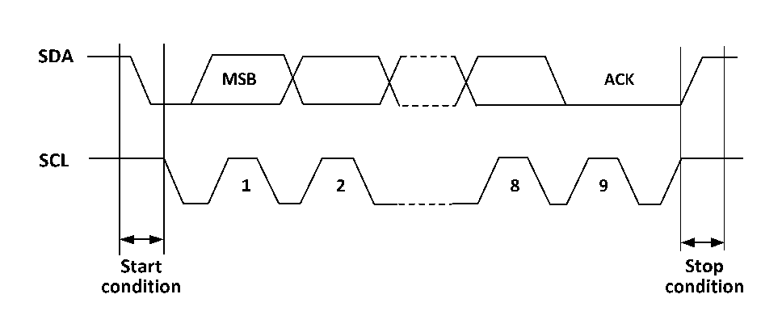

<!-- source-page: 186 -->

[← p.185](0185.md) · [index](../README.md) · [PDF p.186](https://ch32-riscv-ug.github.io/CH32V103/datasheet_zh/CH32xRM.PDF#page=186) · [p.187 →](0187.md)

<!-- header: CH32x103应用手册 https://wch.cn -->

# 第 18 章 内部集成电路总线（I2C）

本章模块描述适用于CH32F103和CH32V103微控制器全系列产品。  
内部集成电路总线（I2C）广泛用在微控制器和传感器及其他片外模块的通讯上，它本身支持多  
主多从模式，仅仅使用两根线（SDA和SCL）就能以100KHz（标准）和400KHz（快速）两种速度通讯。  
I2C总线还兼容SMBus协议，不仅支持I2C的时序，还拥有CRC校验功能。  

## 18.1 主要特征

● 支持主模式和从模式  
● 支持7位或10位地址  
● 从设备支持双7位地址  
● 支持两种速度模式：100KHz和400KHz  
● 多种状态模式，多种错误标志  
● 支持加长的时钟功能  
● 2个中断向量  
● 支持DMA  
● 支持PEC  
● 兼容SMBus  

## 18.2 概述

I2C是个半双工的总线，它同时只能运行在下列四种模式中之一：主设备发送模式、主设备接收  
模式、从设备发送模式和从设备接收模式。I2C模块默认工作在从模式，在产生起始条件后，会自动  
地切换到主模式，当仲裁丢失或者产生停止信号后，会切换到从模式。I2C模块支持多主机功能。工  
作在主模式时，I2C 模块会主动发出数据和地址。数据和地址都以 8 位为单位进行传输，高位在前，  
低位在后，在起始事件后的是一个字节（7位地址模式下）或两个字节（10位地址模式下）地址，主  
机每发送8位数据或地址，从机需要回复一个应答ACK，即把SDA总线拉低，如图18-1所示。  

图18-1 I2C时序图  
 <!-- rendered from the PDF; verify at https://ch32-riscv-ug.github.io/CH32V103/datasheet_zh/CH32xRM.PDF#page=186 -->

🖼 Text parsed from the figure above

<!-- image: p186-draw-image-00002 inside the figure -->
<!-- image: p186-draw-image-00004 inside the figure -->
<!-- image: p186-draw-image-00005 inside the figure -->
<!-- image: p186-draw-image-00003 inside the figure -->
<!-- image: p186-draw-image-00007 inside the figure -->
<!-- image: p186-draw-image-00008 inside the figure -->
<!-- image: p186-draw-image-00009 inside the figure -->
<!-- image: p186-draw-image-00006 inside the figure -->
<!-- image: p186-draw-image-00010 inside the figure -->
<!-- image: p186-draw-image-00012 inside the figure -->
<!-- image: p186-draw-image-00011 inside the figure -->
<!-- image: p186-draw-image-00013 inside the figure -->

为了正常使用必须给I2C输入正确的时钟，其中标准模式下，输入时钟最低为2MHz,在快速模式  
下，输入时钟最低为4MHz。  
图18-2是I2C模块功能框图。  
<!-- image: p186-draw-image-00001 bbox=[507.84, 786.48, 527.52, 797.04] -->
<!-- footer: V2.0 184 -->
