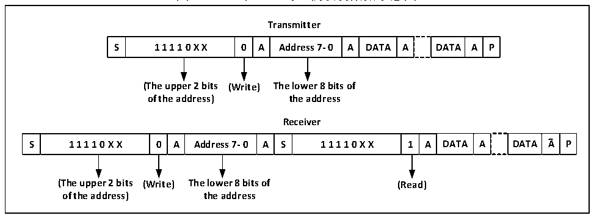
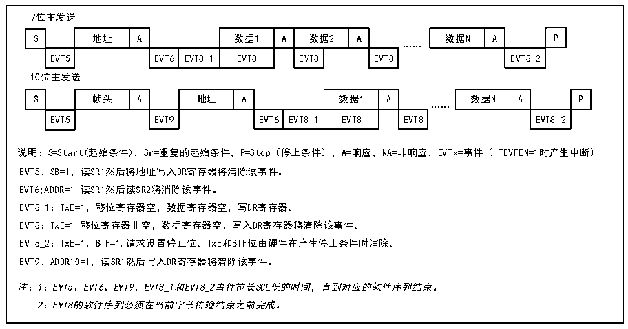

<!-- source-page: 188 -->

[← p.187](0187.md) · [index](../README.md) · [PDF p.188](https://ch32-riscv-ug.github.io/CH32V103/datasheet_zh/CH32xRM.PDF#page=188) · [p.189 →](0189.md)

<!-- header: CH32x103应用手册 https://wch.cn -->
在7位地址模式下，发送的第一个字节为地址字节，头7位代表的是目标从设备地址，第8位决  
定了后续报文的方向，0代表是主设备写入数据到从设备，1代表是主设备向从设备读取信息。  
在10位地址模式下，如图18-3所示，在发送地址阶段，第一个字节为11110xx0，xx为10位地  
址的最高 2 位，第二个字节为 10 位地址的低 8位。若后续进入主设备发送模式，则继续发送数据；  
若后续准备进入主设备接收模式，则需要重新发送一个起始条件，跟随发送一个字节为11110xx1，然  
后进入主设备接收模式。  

图18-3 10位地址时主机收发数据示意图  
 <!-- rendered from the PDF; verify at https://ch32-riscv-ug.github.io/CH32V103/datasheet_zh/CH32xRM.PDF#page=188 -->

🖼 Text parsed from the figure above

<strong>Transmitter</strong>  
S  1 1 1 1 0 X X  0  A  Address 7- 0  A  DATA  A  DATA  A  P  
<strong>(The upper 2 bits (Write) The lower 8 bits of</strong>  
<strong>of the address) the address</strong>  
<strong>Receiver</strong>  
S  1 1 1 1 0 X X  0  A  Address 7- 0  A  S  1 1 1 1 0 X X  1  A  DATA  A  DATA  A  P  
<strong>(The upper 2 bits (Write) The lower 8 bits of (Read)</strong>  
<strong>of the address) the address</strong>  

发送模式：  
主设备内部的移位寄存器将数据从数据寄存器发送到SDA线上，当主设备接收到ACK时，状态寄  
存器1（R16_I2Cx_STAR1）的TxE被置位，如果ITEVTEN和ITBUFEN被置位，还会产生中断。向数据  
寄存器写入数据将会清除TxE位。  
如果 TxE 位被置位且上次发送数据之前没有新的数据被写入数据寄存器，那么 BTF 位会被置位,  
在其被清除之前，SCL将保持低电平，读R16_I2Cx_STAR1后，向数据寄存器写入数据将会清除BTF位。  

图18-4 主发送器传送序列图  
 <!-- rendered from the PDF; verify at https://ch32-riscv-ug.github.io/CH32V103/datasheet_zh/CH32xRM.PDF#page=188 -->

🖼 Text parsed from the figure above

7位主发送  
S  地址  A  数据1  A  数据2  A  EVT5  EVT6  EVT8_1  EVT8  EVT8  EVT8  
数据N  A  P  EVT8_2  
……  
10位主发送  
S  帧头  A  地址  A  数据1  A  EVT5  EVT9  EVT6  EVT8_1  EVT8  … EVT8  
数据N  A  P  EVT8_2  
……  
说明：S=Start(起始条件)，Sr=重复的起始条件，P=Stop（停止条件），A=响应，NA=非响应，EVTx=事件（ITEVFEN=1时产生中断）  
EVT5：SB=1，读SR1然后将地址写入DR寄存器将清除该事件。  
EVT6;ADDR=1,读SR1然后读SR2将消除该事件。  
EVT8_1：TxE=1，移位寄存器空，数据寄存器空，写DR寄存器。  
EVT8：TxE=1,移位寄存器非空，数据寄存器空，写入DR寄存器将清除该事件。  
EVT8_2：TxE=1，BTF=1,请求设置停止位。TxE和BTF位由硬件在产生停止条件时清除。  
EVT9：ADDR10=1，读SR1然后写入DR寄存器将清除该事件。  
注：1：EVT5、EVT6、EVT9、EVT8_1和EVT8_2事件拉长SCL低的时间，直到对应的软件序列结束。  
2：EVT8的软件序列必须在当前字节传输结束之前完成。  

接收模式：  
I2C模块会从SDA线接收数据，通过移位寄存器写进数据寄存器。在每个字节之后，如果ACK位  
被置位，那么 I2C 模块将会发出一个应答低电平，同时 RxNE 位会被置位，如果 ITEVTEN 和 ITBUFEN  
被置位，还会产生中断。如果RxNE被置位且在新的数据被接收前，原有的数据没有被读出，则BTF位  
<!-- image: p188-draw-image-00001 bbox=[507.84, 786.48, 527.52, 797.04] -->
<!-- footer: V2.0 186 -->
