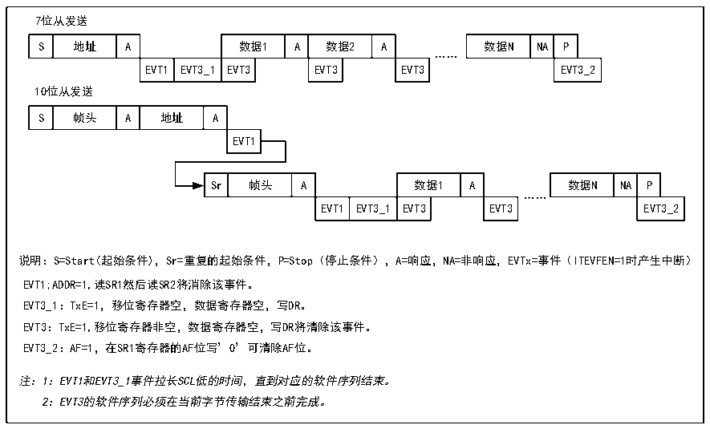
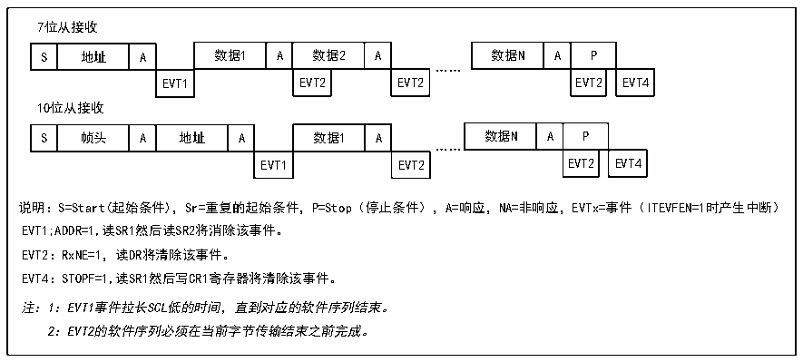

<!-- source-page: 190 -->

[← p.189](0189.md) · [index](../README.md) · [PDF p.190](https://ch32-riscv-ug.github.io/CH32V103/datasheet_zh/CH32xRM.PDF#page=190) · [p.191 →](0191.md)

<!-- header: CH32x103应用手册 https://wch.cn -->

图18-6 从发送器的传送序列图  
 <!-- rendered from the PDF; verify at https://ch32-riscv-ug.github.io/CH32V103/datasheet_zh/CH32xRM.PDF#page=190 -->

🖼 Text parsed from the figure above

7位从发送  
S  地址  A  数据1  A  数据2  A  EVT1  EVT3_1  EVT3  EVT3  EVT3  
数据N  NA  P  EVT3_2  
……  
10位从发送  
S  帧头  A  地址  A  EVT1  
Sr  帧头  A  数据1  A  EVT1  EVT3_1  EVT3  EVT3  
数据N  NA  P  EVT3_2  
……  
说明：S=Start(起始条件)，Sr=重复的起始条件，P=Stop（停止条件），A=响应，NA=非响应，EVTx=事件（ITEVFEN=1时产生中断）  
EVT1;ADDR=1,读SR1然后读SR2将消除该事件。  
EVT3_1：TxE=1，移位寄存器空，数据寄存器空，写DR。  
EVT3：TxE=1,移位寄存器非空，数据寄存器空，写DR将清除该事件。  
EVT3_2：AF=1，在SR1寄存器的AF位写’0’可清除AF位。  
注：1：EVT1和EVT3_1事件拉长SCL低的时间，直到对应的软件序列结束。  
2：EVT3的软件序列必须在当前字节传输结束之前完成。  

接收模式：  
在ADDR被清除后，I2C模块将SDA上的数据通过移位寄存器存进数据寄存器，在每接收到一个  
字节后，I2C模块都会置一个ACK位，并置RxNE位。如果设置了ITEVTEN和ITBUFEN，还会产生一  
个中断。如果RxNE被置位，且在接收到新的数据前旧的数据没有被读出，那么BTF会被置位。在清  
除BTF位之前SCL会保持低电平。读取状态寄存器1（R16_I2Cx_STAR1）并读取数据寄存器里的数  
据会清除BTF位。  

图18-7 从接收器的传送序列图  
 <!-- rendered from the PDF; verify at https://ch32-riscv-ug.github.io/CH32V103/datasheet_zh/CH32xRM.PDF#page=190 -->

🖼 Text parsed from the figure above

7位从接收  
S  地址  A  数据1  A  数据2  A  EVT1  EVT2  EVT2  
数据N  A  P  EVT2  EVT4  
……  
10位从接收  
S  帧头  A  地址  A  数据1  A  EVT1  EVT2  
数据N  A  P  EVT2  EVT4  
……  
EVT1 EVT2 EVT2 EVT4  
说明：S=Start(起始条件)，Sr=重复的起始条件，P=Stop（停止条件），A=响应，NA=非响应，EVTx=事件（ITEVFEN=1时产生中断）  
EVT1;ADDR=1,读SR1然后读SR2将消除该事件。  
EVT2：RxNE=1，读DR将清除该事件。  
EVT4：STOPF=1,读SR1然后写CR1寄存器将清除该事件。  
注：1：EVT1事件拉长SCL低的时间，直到对应的软件序列结束。  
2：EVT2的软件序列必须在当前字节传输结束之前完成。  

主设备在传输完最后一个数据字节后，将产生一个停止条件，当I2C模块检测到停止事件时，  
将置STOPF位，如果设置了ITEVFEN位，还会产生一个中断。用户需要读取状态寄存器  
（R16_I2Cx_STAR1）再写控制寄存器（比如复位控制字SWRST）来清除。（见上图中的EVT4）。  
<!-- image: p190-draw-image-00001 bbox=[507.84, 786.48, 527.52, 797.04] -->
<!-- footer: V2.0 188 -->
