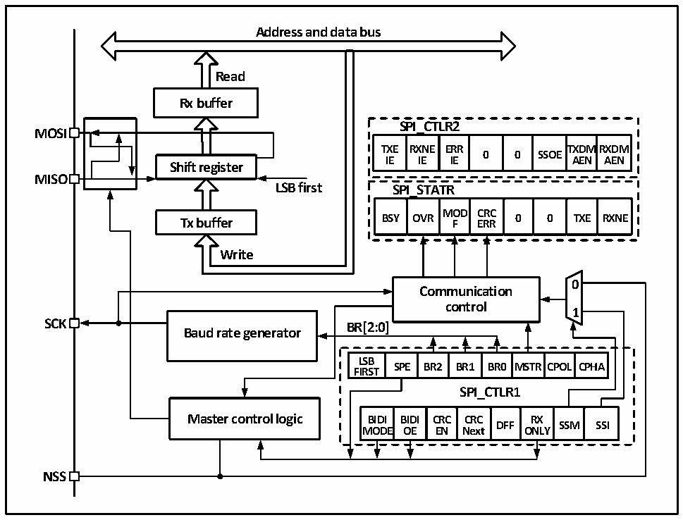

<!-- source-page: 202 -->

[← p.201](0201.md) · [index](../README.md) · [PDF p.202](https://ch32-riscv-ug.github.io/CH32V103/datasheet_zh/CH32xRM.PDF#page=202) · [p.203 →](0203.md)

<!-- header: CH32x103应用手册 https://wch.cn -->

# 第 19 章 串行外设接口（SPI）

本章模块描述适用于CH32F103和CH32V103微控制器全系列产品。  
SPI支持以三线同步串行模式进行数据交互，加上片选线支持硬件切换主从模式，支持以单根数  
据线通讯。  

## 19.1 主要特征

● 支持全双工同步串行模式  
● 支持单线半双工模式  
● 支持主模式和从模式，多从模式  
● 支持8位或者16位数据结构  
● 最高时钟频率支持到Fpclk的一半  
● 数据顺序支持MSB或者LSB在前  
● 支持硬件或者软件控制NSS引脚  
● 收发支持硬件CRC校验  
● 收发缓冲器支持DMA传输  
● 支持修改时钟相位和极性  

## 19.2 SPI 功能描述

### 19.2.1 概述

图19-1 串行外设总线结构框图  
 <!-- rendered from the PDF; verify at https://ch32-riscv-ug.github.io/CH32V103/datasheet_zh/CH32xRM.PDF#page=202 -->

🖼 Text parsed from the figure above

<strong>Address and data bus</strong>  
<strong>Read</strong>  
<strong>Rx buffer</strong>  
<strong>SPI_CTLR2</strong>  
<strong>MOSI</strong>  
<strong>TXE RXNE ERR TXDMRXDM</strong>  
<strong>0 0 SSOE</strong>  
<strong>IE IE IE AEN AEN</strong>  
<strong>Shift register</strong>  
<strong>MISO</strong>  
<strong>LSB first SPI_STATR</strong>  
OVR  MODF  CRCERR  0  0  TXE  
<strong>Tx buffer BSY OVR F ERR 0 0 TXE RXNE</strong>  
<strong>Write</strong>  
<!-- image: p202-draw-image-00002 inside the figure -->
<!-- image: p202-draw-image-00003 inside the figure -->
<strong>0</strong>  
<strong>Communication</strong>  
<strong>control</strong>  
<strong>1</strong>  
<strong>SCK BR[2:0]</strong>  
<strong>Baud rate generator</strong>  
SPE  BR2  BR1  BR0  MSTR  CPOL  CPHA  
<strong>LSB</strong>  
<strong>FIRST</strong>  
<strong>SPI_CTLR1</strong>  
BIDIMODE  BIDIOE  CRCEN  CRCNext  DFF  RXONLY  SSM  SSI  
<strong>NSS</strong>  

<!-- image: p202-draw-image-00001 bbox=[507.84, 786.48, 527.52, 797.04] -->
<!-- footer: V2.0 200 -->
