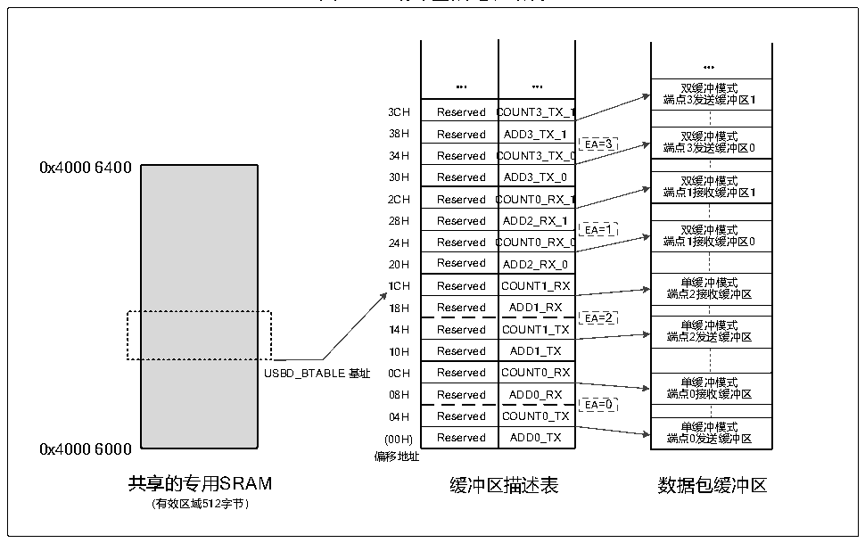

<!-- source-page: 213 -->

[← p.212](0212.md) · [index](../README.md) · [PDF p.213](https://ch32-riscv-ug.github.io/CH32V103/datasheet_zh/CH32xRM.PDF#page=213) · [p.214 →](0214.md)

<!-- header: CH32x103应用手册 https://wch.cn -->
SRAM的访问，即使微控制器连续访问缓冲区，也不会产生访问冲突。  
每个端点配置寄存器对应一组缓冲区描述类寄存器（描述表）及相应数据收发缓冲区域，他们都  
位于共享的 512 字节专用 SRAM 区域内（基地址 0x40006000）。其中，USBD_BTABLE 寄存器定义缓冲  
区描述表在 SRAM 区域内的起始地址，而数据收发缓冲区域可以位于整个专用 SRAM 区域内的任意位  
置，因为它们的地址和长度都定义在对应的缓冲区描述表中，注意分配冲突问题。  
注：当使用CAN时，CAN过滤器表使用共享的512字节专用SRAM区域中的高128字节，USB使用低  
384字节。  

图20-1 缓冲区描述表结构  
 <!-- rendered from the PDF; verify at https://ch32-riscv-ug.github.io/CH32V103/datasheet_zh/CH32xRM.PDF#page=213 -->

🖼 Text parsed from the figure above

...  
... ...  
双缓冲模式  
端点3发送缓冲区1  
3CH Reserved COUNT3_TX_1  
双缓冲模式端点3发送缓冲区0  双缓冲模式端点1接收缓冲区1  双缓冲模式端点1接收缓冲区0  单缓冲模式端点2接收缓冲区  单缓冲模式端点2发送缓冲区  单缓冲模式端点0接收缓冲区  单缓冲模式端点0发送缓冲区  
Reserved  ADD3_TX_1  Reserved Reserved C  ADD3_TX_1COUNT3_TX_0  EA=3  Reserved  ADD3_TX_0  Reserved  COUNT0_RX_1  Reserved Reserved CReserved  ADD2_RX_1COUNT0_RX_0ADD2_RX_0  Reserved  COUNT1_RX  Reserved Reserved  ADD1_RXCOUNT1_TX  Reserved  ADD1_TX  Reserved  COUNT0_RX  Reserved Reserved Reserved  ADD0_RXCOUNT0_TXADD0_TX  
0x4000 6400  
USBD_BTABLE 基址 0CH Reserved COUNT0_RX  
0x4000 6000  
偏移地址  
共享的专用SRAM 缓冲区描述表 数据包缓冲区  
（有效区域512字节）  

不管是接收还是发送，分组缓冲区都是从底部开始使用的。USBD模块不会改变超出当前分配到的  
缓冲区区域以外的其他缓冲区的内容。如果缓冲区收到一个比自己大的数据分组，它只会接收最大为  
自身大小的数据，其他的丢掉，即发生了所谓的缓冲区溢出异常。  
1）端点初始化  
初始化端点的第一步是把适当的值写到 USBD_ADDRx_TX 或 USBD_ADDRx_RX 寄存器中，以便 USBD  
模块能找到要传输的数据或准备好接收数据的缓冲区。USBD_EPRx 寄存器的 EPTYPE[1:0]位确定端点  
的基本类型，EP_KIND 位确定端点的特殊特性。作为发送方，需要设置 USBD_EPRx 寄存器的 STAT_TX  
位来使能端点，并配置 COUNTx_TX 位决定发送长度。作为接收方，需要设置 STAT_RX 位来使能端点，  
并且设置BL_SIZE和NUM_BLOCK位，确定接收缓冲区的大小，以检测缓冲区溢出的异常。对于非同步  
非双缓冲批量传输的单向端点，只需要设置一个传输方向上的寄存器。一旦端点被使能，应用程序就  
不 能 再 修 改 USBD_EPRx 寄 存 器 的 值 和 USBD_ADDRx_TX/USBD_ADDRx_RX ， USBD_COUNTx_TX/  
USBD_COUNTx_RX寄存器所在的位置，因为这些值会被硬件实时修改。当数据传输完成时，CTR中断会  
产生，此时上述寄存器可以被访问，并重新使能新的传输。  
2）IN事务（进行数据发送）  
当接收到一 IN 令牌包时，如果接收到的地址和一个配置好的端点地址相符合，并且此时寄存器  
USBD_EPRx上的STAT_TX位表示可发送的话，USBD模块将会根据缓冲区描述表的内容及DTOG_TX位进  
<!-- image: p213-draw-image-00001 bbox=[507.84, 786.48, 527.52, 797.04] -->
<!-- footer: V2.0 211 -->
