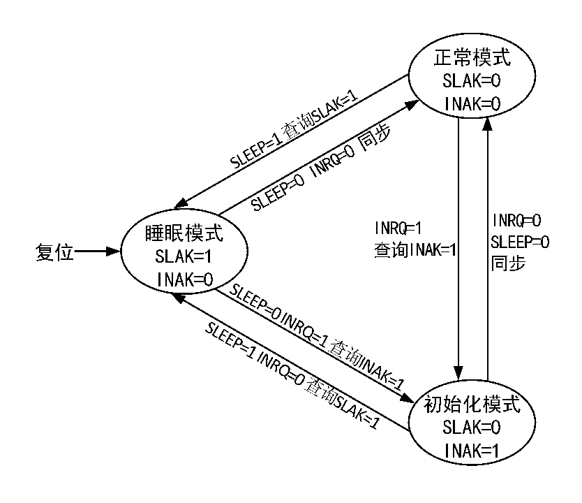

<!-- source-page: 244 -->

[← p.243](0243.md) · [index](../README.md) · [PDF p.244](https://ch32-riscv-ug.github.io/CH32V103/datasheet_zh/CH32xRM.PDF#page=244) · [p.245 →](0245.md)

<!-- header: CH32x103应用手册 https://wch.cn -->

图22-1 CAN工作模式切换  
 <!-- rendered from the PDF; verify at https://ch32-riscv-ug.github.io/CH32V103/datasheet_zh/CH32xRM.PDF#page=244 -->

🖼 Text parsed from the figure above

<!-- image: p244-draw-image-00009 inside the figure -->
<!-- image: p244-draw-image-00012 inside the figure -->
<!-- image: p244-draw-image-00010 inside the figure -->
<!-- image: p244-draw-image-00011 inside the figure -->
<!-- image: p244-draw-image-00030 inside the figure -->
<!-- image: p244-draw-image-00029 inside the figure -->
<!-- image: p244-draw-image-00028 inside the figure -->
<!-- image: p244-draw-image-00015 inside the figure -->
<!-- image: p244-draw-image-00013 inside the figure -->
<!-- image: p244-draw-image-00014 inside the figure -->
<!-- image: p244-draw-image-00027 inside the figure -->
<!-- image: p244-draw-image-00037 inside the figure -->
<!-- image: p244-draw-image-00026 inside the figure -->
<!-- image: p244-draw-image-00025 inside the figure -->
<!-- image: p244-draw-image-00024 inside the figure -->
<!-- image: p244-draw-image-00036 inside the figure -->
<!-- image: p244-draw-image-00035 inside the figure -->
<!-- image: p244-draw-image-00034 inside the figure -->
<!-- image: p244-draw-image-00033 inside the figure -->
<!-- image: p244-draw-image-00032 inside the figure -->
<!-- image: p244-draw-image-00031 inside the figure -->
<!-- image: p244-draw-image-00065 inside the figure -->
<!-- image: p244-draw-image-00067 inside the figure -->
<!-- image: p244-draw-image-00066 inside the figure -->
<!-- image: p244-draw-image-00058 inside the figure -->
<!-- image: p244-draw-image-00060 inside the figure -->
<!-- image: p244-draw-image-00002 inside the figure -->
<!-- image: p244-draw-image-00059 inside the figure -->
<!-- image: p244-draw-image-00068 inside the figure -->
<!-- image: p244-draw-image-00070 inside the figure -->
<!-- image: p244-draw-image-00069 inside the figure -->
<!-- image: p244-draw-image-00061 inside the figure -->
<!-- image: p244-draw-image-00023 inside the figure -->
<!-- image: p244-draw-image-00062 inside the figure -->
<!-- image: p244-draw-image-00064 inside the figure -->
<!-- image: p244-draw-image-00063 inside the figure -->
<!-- image: p244-draw-image-00003 inside the figure -->
<!-- image: p244-draw-image-00005 inside the figure -->
<!-- image: p244-draw-image-00004 inside the figure -->
<!-- image: p244-draw-image-00071 inside the figure -->
<!-- image: p244-draw-image-00008 inside the figure -->
<!-- image: p244-draw-image-00006 inside the figure -->
<!-- image: p244-draw-image-00007 inside the figure -->
<!-- image: p244-draw-image-00038 inside the figure -->
<!-- image: p244-draw-image-00039 inside the figure -->
<!-- image: p244-draw-image-00040 inside the figure -->
<!-- image: p244-draw-image-00041 inside the figure -->
<!-- image: p244-draw-image-00048 inside the figure -->
<!-- image: p244-draw-image-00042 inside the figure -->
<!-- image: p244-draw-image-00043 inside the figure -->
<!-- image: p244-draw-image-00044 inside the figure -->
<!-- image: p244-draw-image-00049 inside the figure -->
<!-- image: p244-draw-image-00050 inside the figure -->
<!-- image: p244-draw-image-00051 inside the figure -->
<!-- image: p244-draw-image-00045 inside the figure -->
<!-- image: p244-draw-image-00052 inside the figure -->
<!-- image: p244-draw-image-00053 inside the figure -->
<!-- image: p244-draw-image-00046 inside the figure -->
<!-- image: p244-draw-image-00054 inside the figure -->
<!-- image: p244-draw-image-00047 inside the figure -->
<!-- image: p244-draw-image-00016 inside the figure -->
<!-- image: p244-draw-image-00055 inside the figure -->
<!-- image: p244-draw-image-00056 inside the figure -->
<!-- image: p244-draw-image-00057 inside the figure -->
<!-- image: p244-draw-image-00019 inside the figure -->
<!-- image: p244-draw-image-00017 inside the figure -->
<!-- image: p244-draw-image-00018 inside the figure -->
<!-- image: p244-draw-image-00020 inside the figure -->
<!-- image: p244-draw-image-00022 inside the figure -->
<!-- image: p244-draw-image-00021 inside the figure -->

## 22.3 CAN 控制器测试模式

在初始化模式下，对寄存器CAN_BTIMR的SILM和LBKM位进行操作，可以准备进入其中一种测试  
模式，然后通过对寄存器CAN_CTLR的INRQ位清零，退出初始化模式，进入测试模式。测试模式分为  
静默模式、环回模式和静默环回模式三种。  

### 22.3.1 静默测试模式

对寄存器 CAN_BTIMR 的 SILM 位置 1，可选择准备进入静默模式。该模式下，CAN 控制器可以接  
收，不能对外发送报文，对外总是处于隐性位，避免对总线产生影响，但是报文能够被所在节点的控  
制器所接收。通常静默模式被用于CAN总线的状态分析。  

### 22.3.2 环回测试模式

对寄存器CAN_BTIMR的LBKM位置1，可选择准备进入环回模式。该模式下，CAN控制器可以对外  
发送报文，不能接收外部报文，但是发送报文能够被所在节点的控制器所接收，接收过滤机制有效。  
通常环回模式被用于CAN控制器的收发测试。  

### 22.3.3 静默环回测试模式

对寄存器CAN_BTIMR的SILM和LBKM位置1，可选择准备进入静默环回模式。该模式通常用于CAN  
控制器封闭自测试，在该模式下，对CAN总线无影响，RX引脚与总线断开，TX引脚置隐性位。  
<!-- image: p244-draw-image-00001 bbox=[507.84, 786.48, 527.52, 797.04] -->
<!-- footer: V2.0 242 -->
