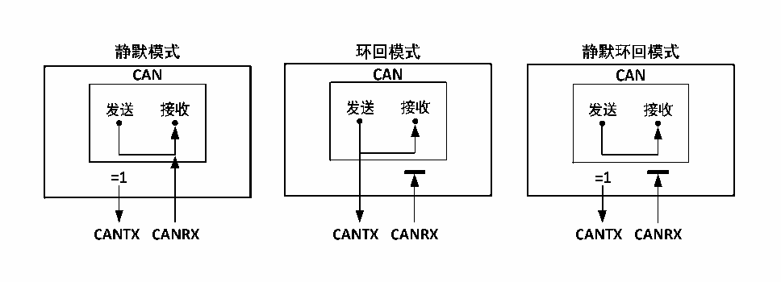

<!-- source-page: 245 -->

[← p.244](0244.md) · [index](../README.md) · [PDF p.245](https://ch32-riscv-ug.github.io/CH32V103/datasheet_zh/CH32xRM.PDF#page=245) · [p.246 →](0246.md)

<!-- header: CH32x103应用手册 https://wch.cn -->

图22-2 CAN总线的三种测试模式  
 <!-- rendered from the PDF; verify at https://ch32-riscv-ug.github.io/CH32V103/datasheet_zh/CH32xRM.PDF#page=245 -->

🖼 Text parsed from the figure above

<!-- image: p245-draw-image-00021 inside the figure -->
<!-- image: p245-draw-image-00023 inside the figure -->
<!-- image: p245-draw-image-00022 inside the figure -->
<!-- image: p245-draw-image-00005 inside the figure -->
<!-- image: p245-draw-image-00002 inside the figure -->
<!-- image: p245-draw-image-00008 inside the figure -->
<!-- image: p245-draw-image-00007 inside the figure -->
<!-- image: p245-draw-image-00006 inside the figure -->
<!-- image: p245-draw-image-00004 inside the figure -->
<!-- image: p245-draw-image-00003 inside the figure -->
<!-- image: p245-draw-image-00010 inside the figure -->
<!-- image: p245-draw-image-00009 inside the figure -->
<!-- image: p245-draw-image-00012 inside the figure -->
<!-- image: p245-draw-image-00016 inside the figure -->
<!-- image: p245-draw-image-00011 inside the figure -->
<!-- image: p245-draw-image-00015 inside the figure -->
<!-- image: p245-draw-image-00013 inside the figure -->
<!-- image: p245-draw-image-00014 inside the figure -->
<!-- image: p245-draw-image-00017 inside the figure -->
<!-- image: p245-draw-image-00018 inside the figure -->
<!-- image: p245-draw-image-00019 inside the figure -->
<!-- image: p245-draw-image-00020 inside the figure -->

## 22.4 CAN 控制器功能描述

### 22.4.1 发送处理流程

发送处理流程如下：如果三个发送邮箱中有空置的邮箱，应用层软件仅对空置邮箱的寄存器具有  
写入权限，对寄存器 CAN_TXMIRx、CAN_TXMDTRx、CAN_TXMDLRx 和 CAN_TXMDHRx 进行操作，可以设置  
报文标识符、报文长度、时间戳和报文数据等。在数据准备好之后，对寄存器CAN_TXMIRx的TXRQ位  
置1请求发送，邮箱进入挂号状态，并进行优先级排队；一旦成为最高优先级邮箱，则变为预定发送  
状态，等待CAN总线空闲；当CAN总线空闲时，预定发送邮箱的报文立刻进入发送状态；报文发送完  
毕后，邮箱重新成为空置邮箱，并且寄存器CAN_TSTATR的RQCP和TXOK位置1，来指示发送成功；若  
发送时仲裁失败，寄存器CAN_TSTATR的ALST位置1，若发送错误，则TERR位置1。  

### 22.4.2 发送优先级

发送优先级可以由标识符或发送请求先后次序决定，寄存器CAN_CTLR的TXFP位置1按发送请求  
先后次序发送，按发送请求先后次序主要应用于分段发送；清0按标识符优先级决定发送次序，标识  
符越小则优先级越高，同标识符的情况下，则低编号的邮箱有更高优先级。  

### 22.4.3 发送中止处理

若对寄存器CAN_TSTATR的ABRQ位置1，则可以中止发送请求。当邮箱状态为挂号或预定发送状  
态时，发送请求直接中止；当邮箱处于发送状态时，中止请求可能会成功（停止发送），也有可能会  
失败（发送完成），结果可由寄存器CAN_TSTATR的TXOK位来查询。  

### 22.4.4 基于时间触发模式

传统的 CAN 基于事件触发模式，在该模式下总线繁忙时，容易造成低优先级的消息长时间阻塞，  
甚至无法满足其时限的要求。为了解决该瓶颈，推出了基于时间触发模式的相关协议，此类协议在工  
业上有一定规模的应用，基于时间触发模式的功能即为配合此类协议的应用。  
对寄存器CAN_CTLR的TTCM位置1，使能时间触发模式，此时内部定时器被激活用来产生发送和  
接收邮箱的时间戳，定时器在CAN位时间累加，并在位时间采样点位置被采样产生时间戳。  

### 22.4.5 接收处理流程

CAN总线报文的接收，由控制器硬件来完成，无需MCU的干涉，减轻了MCU的处理负荷。所接收  
到的报文，根据寄存器 CAN_FAFIFOR 的设置，分别被存储到两个具有 3 级邮箱深度的 FIFO中，应用  
层如需获取报文，只能通过接收FIFO邮箱来读取有效接收报文。  
初始时，接收 FIFO为空，接收 FIFO寄存器 CAN_RFIFOx的 FMR[1:0]值为二进制 00b，接到一个  
有效接收报文后，变为挂号 1 状态，控制器自动把接收 FIFO 寄存器 CAN_RFIFOx 的 FMR[1:0]设置二  
<!-- image: p245-draw-image-00001 bbox=[507.84, 786.48, 527.52, 797.04] -->
<!-- footer: V2.0 243 -->
