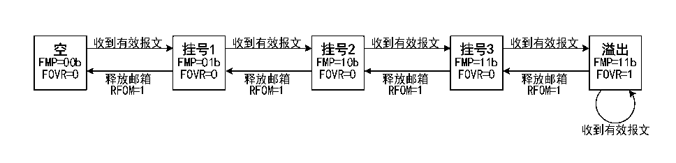

<!-- source-page: 246 -->

[← p.245](0245.md) · [index](../README.md) · [PDF p.246](https://ch32-riscv-ug.github.io/CH32V103/datasheet_zh/CH32xRM.PDF#page=246) · [p.247 →](0247.md)

<!-- header: CH32x103应用手册 https://wch.cn -->
进制 01b；若此时读取邮箱数据寄存器 CAN_RXMDLRx 和 CAN_RXMDHRx，通过对接收 FIFO 寄存器  
CAN_RFIFOx的RFOM位置1来释放邮箱，接收FIFO状态又变为空；如果在挂号1状态时不释放邮箱，  
下一个有效接收报文被接到后，接收FIFO状态切换为挂号2状态，此时接收FIFO寄存器CAN_RFIFOx  
的FMR[1:0]自动置二进制10b；若读取邮箱数据寄存器并释放邮箱，则状态回到挂号1；如果在挂号  
2 状态不释放邮箱，则接收 FIFO 进入挂号 3 状态；同样在挂号 3 状态下读取报文并释放邮箱，则返  
回挂号2状态；若在挂号3状态不释放邮箱，则在接收到下一个有效报文时，必然导致报文丢失情况  
出现。  

图22-3 接收FIFO状态切换图  
 <!-- rendered from the PDF; verify at https://ch32-riscv-ug.github.io/CH32V103/datasheet_zh/CH32xRM.PDF#page=246 -->

🖼 Text parsed from the figure above

<!-- image: p246-draw-image-00010 inside the figure -->
<!-- image: p246-draw-image-00024 inside the figure -->
<!-- image: p246-draw-image-00038 inside the figure -->
<!-- image: p246-draw-image-00052 inside the figure -->
<!-- image: p246-draw-image-00002 inside the figure -->
<!-- image: p246-draw-image-00057 inside the figure -->
<!-- image: p246-draw-image-00015 inside the figure -->
<!-- image: p246-draw-image-00029 inside the figure -->
<!-- image: p246-draw-image-00043 inside the figure -->
<!-- image: p246-draw-image-00030 inside the figure -->
<!-- image: p246-draw-image-00044 inside the figure -->
<!-- image: p246-draw-image-00016 inside the figure -->
<!-- image: p246-draw-image-00005 inside the figure -->
<!-- image: p246-draw-image-00019 inside the figure -->
<!-- image: p246-draw-image-00033 inside the figure -->
<!-- image: p246-draw-image-00047 inside the figure -->
<!-- image: p246-draw-image-00060 inside the figure -->
<!-- image: p246-draw-image-00003 inside the figure -->
<!-- image: p246-draw-image-00006 inside the figure -->
<!-- image: p246-draw-image-00017 inside the figure -->
<!-- image: p246-draw-image-00020 inside the figure -->
<!-- image: p246-draw-image-00031 inside the figure -->
<!-- image: p246-draw-image-00034 inside the figure -->
<!-- image: p246-draw-image-00045 inside the figure -->
<!-- image: p246-draw-image-00048 inside the figure -->
<!-- image: p246-draw-image-00058 inside the figure -->
<!-- image: p246-draw-image-00061 inside the figure -->
<!-- image: p246-draw-image-00004 inside the figure -->
<!-- image: p246-draw-image-00018 inside the figure -->
<!-- image: p246-draw-image-00032 inside the figure -->
<!-- image: p246-draw-image-00046 inside the figure -->
<!-- image: p246-draw-image-00059 inside the figure -->
<!-- image: p246-draw-image-00007 inside the figure -->
<!-- image: p246-draw-image-00009 inside the figure -->
<!-- image: p246-draw-image-00021 inside the figure -->
<!-- image: p246-draw-image-00023 inside the figure -->
<!-- image: p246-draw-image-00035 inside the figure -->
<!-- image: p246-draw-image-00037 inside the figure -->
<!-- image: p246-draw-image-00049 inside the figure -->
<!-- image: p246-draw-image-00051 inside the figure -->
<!-- image: p246-draw-image-00062 inside the figure -->
<!-- image: p246-draw-image-00064 inside the figure -->
<!-- image: p246-draw-image-00008 inside the figure -->
<!-- image: p246-draw-image-00022 inside the figure -->
<!-- image: p246-draw-image-00036 inside the figure -->
<!-- image: p246-draw-image-00050 inside the figure -->
<!-- image: p246-draw-image-00063 inside the figure -->
<!-- image: p246-draw-image-00011 inside the figure -->
<!-- image: p246-draw-image-00025 inside the figure -->
<!-- image: p246-draw-image-00039 inside the figure -->
<!-- image: p246-draw-image-00053 inside the figure -->
<!-- image: p246-draw-image-00012 inside the figure -->
<!-- image: p246-draw-image-00014 inside the figure -->
<!-- image: p246-draw-image-00026 inside the figure -->
<!-- image: p246-draw-image-00028 inside the figure -->
<!-- image: p246-draw-image-00040 inside the figure -->
<!-- image: p246-draw-image-00042 inside the figure -->
<!-- image: p246-draw-image-00054 inside the figure -->
<!-- image: p246-draw-image-00056 inside the figure -->
<!-- image: p246-draw-image-00013 inside the figure -->
<!-- image: p246-draw-image-00027 inside the figure -->
<!-- image: p246-draw-image-00041 inside the figure -->
<!-- image: p246-draw-image-00055 inside the figure -->
<!-- image: p246-draw-image-00065 inside the figure -->

上文中的报文丢失情况，即接收FIFO为满，报文溢出导致报文丢失，接收FIFO寄存器CAN_RFIFOx  
的 FOVR位会硬件自动置 1，以供溢出查询。寄存器CAN_CTLR的 RFLM位置 1，则接收 FIFO锁定功能  
启用，丢弃的报文为新接收报文；寄存器CAN_CTLR的RFLM位清0，则接收FIFO锁定功能停用，接收  
FIFO的三个原报文中，最后接收的报文会被新报文覆盖。  
当寄存器CAN_INTENR相关位置位，可以使接收FIFO状态切换时产生中断，以便更高效的处理接  
收报文，详见22.6节CAN中断。  

### 22.4.6 接收报文标识符过滤

模块中有着多达 14 个过滤器组，通过设置过滤器组，每个 CAN 节点都可以接收到符合过滤规则  
的报文，不符合过滤规则的报文被硬件丢弃，无需软件干涉。  
每个过滤器组由 2个 32位寄存器 CAN_FxR0和 CAN_FxR1组成。过滤器组的位宽都可以通过设置  
寄存器 CAN_FSCFGR的各个位独立配置成 1个 32位过滤器或两个 16位过滤器。每个过滤器组可通过  
设置寄存器 CAN_FMCFGR 的各个位配置为屏蔽位或标识符列表模式，各个过滤器器组可以通过设置寄  
存器CAN_FWR的各个位选择启用或禁用。设置寄存器CAN_FAFIFOR的各个位可以把选择通过过滤器的  
报文存放到哪个接收FIFO。  
如下表 22-1 所示，屏蔽位模式下，两个寄存器分别为标识符寄存器和屏蔽寄存器，两者需要配  
合使用，标识符寄存器每一位指示相应的位期望值为显性或隐性，屏蔽寄存器每一位指示相应位是否  
需要对应标识符寄存器位期望值一致。  

<!-- p246-table-001 (table-22-1@1) -->
<table><caption>表22-1 32位屏蔽位模式</caption><tr><th style="text-align:left">标识符寄存器</th><th>CAN_FxR1[31:24]</th><th colspan="2">CAN_FxR1[23:16]</th><th>CAN_FxR1[15:8]</th><th colspan="4">CAN_FxR1[7:0]</th></tr><tr><td style="text-align:left">屏蔽位寄存器</td><td>CAN_FxR2[31:24]</td><td colspan="2">CAN_FxR2[23:16]</td><td>CAN_FxR2[15:8]</td><td colspan="4">CAN_FxR2[7:0]</td></tr><tr><td>映射</td><td>STID[10:3]</td><td>STID[2:0]</td><td>EXID[17:13]</td><td>EXID[12:5]</td><td>EXID[4:0]</td><td>IDE</td><td>RTR</td><td>0</td></tr></table>

标识符列表模式下，两个寄存器都被用作标识符寄存器，接收报文标识符必须与其中一个寄存器  
保持一致才能通过筛选。  

<!-- p246-table-002 (table-22-2@1) pages 246-247 -->
<table><caption>表22-2 32位标识符列表模式</caption><tr><th colspan="2" style="text-align:left">标识符寄存器</th><th>CAN_FxR1[31:24]</th><th colspan="2">CAN_FxR1[23:16]</th><th>CAN_FxR1[15:8]</th><th colspan="5">CAN_FxR1[7:0]</th></tr><tr><td></td><td style="text-align:left">屏蔽位寄存器</td><td>CAN_FxR2[31:24]</td><td colspan="2">CAN_FxR2[23:16]</td><td>CAN_FxR2[15:8]</td><td colspan="4">CAN_FxR2[7:0]</td><td></td></tr><tr><td></td><td>映射</td><td>STID[10:3]</td><td>STID[2:0]</td><td>EXID[17:13]</td><td>EXID[12:5]</td><td>EXID[4:0]</td><td>IDE</td><td>RTR</td><td>0</td><td></td></tr></table>

<!-- image: p246-draw-image-00001 bbox=[507.84, 786.48, 527.52, 797.04] -->
<!-- footer: V2.0 244 -->
