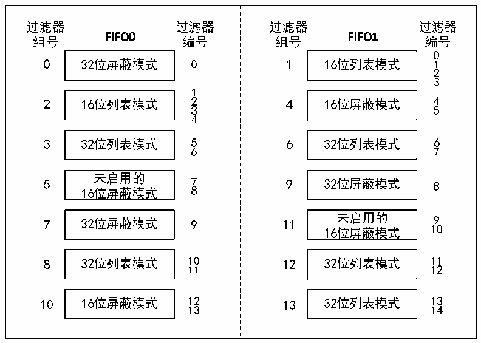
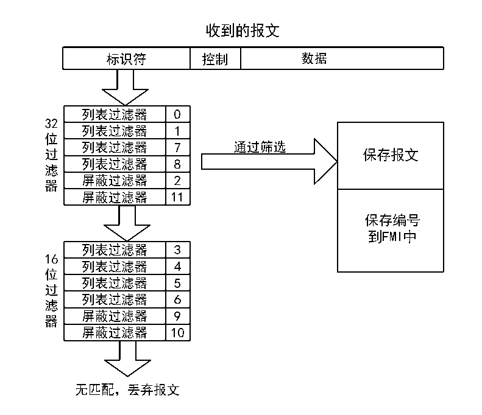

<!-- source-page: 248 -->

[← p.247](0247.md) · [index](../README.md) · [PDF p.248](https://ch32-riscv-ug.github.io/CH32V103/datasheet_zh/CH32xRM.PDF#page=248) · [p.249 →](0249.md)

<!-- header: CH32x103应用手册 https://wch.cn -->

图22-4 过滤器编号的示例  
 <!-- rendered from the PDF; verify at https://ch32-riscv-ug.github.io/CH32V103/datasheet_zh/CH32xRM.PDF#page=248 -->

🖼 Text parsed from the figure above

<!-- image: p248-draw-image-00002 inside the figure -->
<!-- image: p248-draw-image-00006 inside the figure -->
<!-- image: p248-draw-image-00044 inside the figure -->
<!-- image: p248-draw-image-00048 inside the figure -->
<!-- image: p248-draw-image-00004 inside the figure -->
<!-- image: p248-draw-image-00005 inside the figure -->
<!-- image: p248-draw-image-00046 inside the figure -->
<!-- image: p248-draw-image-00047 inside the figure -->
<!-- image: p248-draw-image-00007 inside the figure -->
<!-- image: p248-draw-image-00049 inside the figure -->
<!-- image: p248-draw-image-00003 inside the figure -->
<!-- image: p248-draw-image-00045 inside the figure -->
<!-- image: p248-draw-image-00072 inside the figure -->
<!-- image: p248-draw-image-00011 inside the figure -->
<!-- image: p248-draw-image-00053 inside the figure -->
<!-- image: p248-draw-image-00023 inside the figure -->
<!-- image: p248-draw-image-00065 inside the figure -->
<!-- image: p248-draw-image-00030 inside the figure -->
<!-- image: p248-draw-image-00010 inside the figure -->
<!-- image: p248-draw-image-00052 inside the figure -->
<!-- image: p248-draw-image-00073 inside the figure -->
<!-- image: p248-draw-image-00074 inside the figure -->
<!-- image: p248-draw-image-00075 inside the figure -->
<!-- image: p248-draw-image-00031 inside the figure -->
<!-- image: p248-draw-image-00032 inside the figure -->
<!-- image: p248-draw-image-00076 inside the figure -->
<!-- image: p248-draw-image-00009 inside the figure -->
<!-- image: p248-draw-image-00051 inside the figure -->
<!-- image: p248-draw-image-00024 inside the figure -->
<!-- image: p248-draw-image-00066 inside the figure -->
<!-- image: p248-draw-image-00008 inside the figure -->
<!-- image: p248-draw-image-00050 inside the figure -->
<!-- image: p248-draw-image-00033 inside the figure -->
<!-- image: p248-draw-image-00077 inside the figure -->
<!-- image: p248-draw-image-00034 inside the figure -->
<!-- image: p248-draw-image-00013 inside the figure -->
<!-- image: p248-draw-image-00055 inside the figure -->
<!-- image: p248-draw-image-00035 inside the figure -->
<!-- image: p248-draw-image-00078 inside the figure -->
<!-- image: p248-draw-image-00025 inside the figure -->
<!-- image: p248-draw-image-00012 inside the figure -->
<!-- image: p248-draw-image-00067 inside the figure -->
<!-- image: p248-draw-image-00054 inside the figure -->
<!-- image: p248-draw-image-00036 inside the figure -->
<!-- image: p248-draw-image-00079 inside the figure -->
<!-- image: p248-draw-image-00014 inside the figure -->
<!-- image: p248-draw-image-00037 inside the figure -->
<!-- image: p248-draw-image-00057 inside the figure -->
<!-- image: p248-draw-image-00056 inside the figure -->
<!-- image: p248-draw-image-00068 inside the figure -->
<!-- image: p248-draw-image-00026 inside the figure -->
<!-- image: p248-draw-image-00080 inside the figure -->
<!-- image: p248-draw-image-00038 inside the figure -->
<!-- image: p248-draw-image-00016 inside the figure -->
<!-- image: p248-draw-image-00015 inside the figure -->
<!-- image: p248-draw-image-00062 inside the figure -->
<!-- image: p248-draw-image-00081 inside the figure -->
<!-- image: p248-draw-image-00022 inside the figure -->
<!-- image: p248-draw-image-00021 inside the figure -->
<!-- image: p248-draw-image-00069 inside the figure -->
<!-- image: p248-draw-image-00027 inside the figure -->
<!-- image: p248-draw-image-00039 inside the figure -->
<!-- image: p248-draw-image-00082 inside the figure -->
<!-- image: p248-draw-image-00064 inside the figure -->
<!-- image: p248-draw-image-00063 inside the figure -->
<!-- image: p248-draw-image-00040 inside the figure -->
<!-- image: p248-draw-image-00083 inside the figure -->
<!-- image: p248-draw-image-00020 inside the figure -->
<!-- image: p248-draw-image-00061 inside the figure -->
<!-- image: p248-draw-image-00019 inside the figure -->
<!-- image: p248-draw-image-00060 inside the figure -->
<!-- image: p248-draw-image-00028 inside the figure -->
<!-- image: p248-draw-image-00070 inside the figure -->
<!-- image: p248-draw-image-00084 inside the figure -->
<!-- image: p248-draw-image-00041 inside the figure -->
<!-- image: p248-draw-image-00042 inside the figure -->
<!-- image: p248-draw-image-00085 inside the figure -->
<!-- image: p248-draw-image-00018 inside the figure -->
<!-- image: p248-draw-image-00059 inside the figure -->
<!-- image: p248-draw-image-00017 inside the figure -->
<!-- image: p248-draw-image-00058 inside the figure -->
<!-- image: p248-draw-image-00029 inside the figure -->
<!-- image: p248-draw-image-00071 inside the figure -->
<!-- image: p248-draw-image-00043 inside the figure -->
<!-- image: p248-draw-image-00086 inside the figure -->

图22-5 过滤器过滤示例  
 <!-- rendered from the PDF; verify at https://ch32-riscv-ug.github.io/CH32V103/datasheet_zh/CH32xRM.PDF#page=248 -->

🖼 Text parsed from the figure above

<!-- image: p248-draw-image-00087 inside the figure -->
<!-- image: p248-draw-image-00090 inside the figure -->
<!-- image: p248-draw-image-00088 inside the figure -->
<!-- image: p248-draw-image-00089 inside the figure -->
<!-- image: p248-draw-image-00091 inside the figure -->
<!-- image: p248-draw-image-00092 inside the figure -->
<!-- image: p248-draw-image-00103 inside the figure -->
<!-- image: p248-draw-image-00093 inside the figure -->
<!-- image: p248-draw-image-00094 inside the figure -->
<!-- image: p248-draw-image-00104 inside the figure -->
<!-- image: p248-draw-image-00128 inside the figure -->
<!-- image: p248-draw-image-00095 inside the figure -->
<!-- image: p248-draw-image-00096 inside the figure -->
<!-- image: p248-draw-image-00129 inside the figure -->
<!-- image: p248-draw-image-00105 inside the figure -->
<!-- image: p248-draw-image-00097 inside the figure -->
<!-- image: p248-draw-image-00098 inside the figure -->
<!-- image: p248-draw-image-00106 inside the figure -->
<!-- image: p248-draw-image-00099 inside the figure -->
<!-- image: p248-draw-image-00100 inside the figure -->
<!-- image: p248-draw-image-00107 inside the figure -->
<!-- image: p248-draw-image-00101 inside the figure -->
<!-- image: p248-draw-image-00102 inside the figure -->
<!-- image: p248-draw-image-00130 inside the figure -->
<!-- image: p248-draw-image-00131 inside the figure -->
<!-- image: p248-draw-image-00133 inside the figure -->
<!-- image: p248-draw-image-00132 inside the figure -->
<!-- image: p248-draw-image-00108 inside the figure -->
<!-- image: p248-draw-image-00109 inside the figure -->
<!-- image: p248-draw-image-00120 inside the figure -->
<!-- image: p248-draw-image-00110 inside the figure -->
<!-- image: p248-draw-image-00111 inside the figure -->
<!-- image: p248-draw-image-00121 inside the figure -->
<!-- image: p248-draw-image-00112 inside the figure -->
<!-- image: p248-draw-image-00113 inside the figure -->
<!-- image: p248-draw-image-00122 inside the figure -->
<!-- image: p248-draw-image-00114 inside the figure -->
<!-- image: p248-draw-image-00115 inside the figure -->
<!-- image: p248-draw-image-00123 inside the figure -->
<!-- image: p248-draw-image-00116 inside the figure -->
<!-- image: p248-draw-image-00117 inside the figure -->
<!-- image: p248-draw-image-00124 inside the figure -->
<!-- image: p248-draw-image-00118 inside the figure -->
<!-- image: p248-draw-image-00119 inside the figure -->
<!-- image: p248-draw-image-00127 inside the figure -->
<!-- image: p248-draw-image-00125 inside the figure -->
<!-- image: p248-draw-image-00126 inside the figure -->

### 22.4.7 出错处理

CAN控制器依靠状态错误寄存器CAN_ERRSR，对于总线上的出错管理。状态错误寄存器CAN_ERRSR  
里的TEC和REC，分别代表发送和接收错误计数值，根据随着收发错误的增加而增加，收发成功而减  
小，可以根据它们的值来判断CAN总线的稳定性。  
当状态错误寄存器CAN_ERRSR里的TEC和REC小于128时，当前CAN节点处于错误主动状态，可  
<!-- image: p248-draw-image-00001 bbox=[507.84, 786.48, 527.52, 797.04] -->
<!-- footer: V2.0 246 -->
