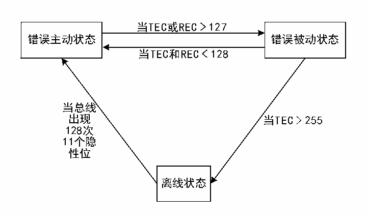

<!-- source-page: 249 -->

[← p.248](0248.md) · [index](../README.md) · [PDF p.249](https://ch32-riscv-ug.github.io/CH32V103/datasheet_zh/CH32xRM.PDF#page=249) · [p.250 →](0250.md)

<!-- header: CH32x103应用手册 https://wch.cn -->
以正常参与总线通信，并且在侦测到错误的时候发出主动错误标志。  
当状态错误寄存器CAN_ERRSR里的TEC和REC大于127时，当前CAN节点处于错误被动状态，并  
且在侦测到错误的时候不允许发出主动错误标志，只能发出被动错误标志。  
当状态错误寄存器CAN_ERRSR里的TEC大于255时，当前CAN节点进入离线状态。  
当总线监测到 128 次出现 11 个连续的隐性位时，恢复到错误主动状态，该恢复方式受主控制寄  
存器 CAN_CTLR里的 ABOM位影响。若 ABOM置 1，则硬件自动退出离线状态。若 ABOM为 0，则需要软  
件操作INRQ位进入初识化模式，随后退出初始化，才能退出离线状态。  

图22-6 CAN错误状态切换图  
 <!-- rendered from the PDF; verify at https://ch32-riscv-ug.github.io/CH32V103/datasheet_zh/CH32xRM.PDF#page=249 -->

🖼 Text parsed from the figure above

当TEC或REC 127  
<!-- image: p249-draw-image-00002 inside the figure -->
错误主动状态 错误被动状态  
当TEC和REC 128  
<!-- image: p249-draw-image-00003 inside the figure -->
当总线  
出现 当TEC&gt;255  
128次  
11个隐  
性位  
离线状态  

### 22.4.8 位时序

按照CAN总线的标准，将每一位时间分为四段：分别为同步段、传播时间段、相位缓冲段1和相  
位缓冲段2。这些段由最小时间单元Tq组成。CAN控制器通过采样来监测CAN总线变化，通过帧起始  
位的边沿进行同步  
CAN控制器把上述四段重新划分为三段，分别为：  
● 同步段(SS)：也就是CAN标准里的同步段，固定为1个最小时间单元，正常情况下所期望  
的位跳变发生在本时间段内。  
● 时间段1(BS1)：包含CAN标准里的传播时间段和相位缓冲段1，可以被设置为包含1到16  
最小时间单元，可以被自动延长，用于补偿CAN总线上不同节点频率精度误差带来的相位  
正向漂移。该时间段结束为采样点位置。  
● 时间段2(BS2)：也就是CAN标准里的相位缓冲段2，可以被设置为1到8个最小时间单  
元，可以被自动缩短，以补偿CAN总线上不同节点频率精度误差带来的相位负向漂移。  
重新同步跳转宽度(SJW)，是每位中可以延长和缩小的最小时间单元数量上限，范围可设置为 1  
到4个最小时间单元。  
上述参数都可以在CAN总线时序寄存器CAN_BTIMR里配置。  
<!-- image: p249-draw-image-00001 bbox=[507.84, 786.48, 527.52, 797.04] -->
<!-- footer: V2.0 247 -->
