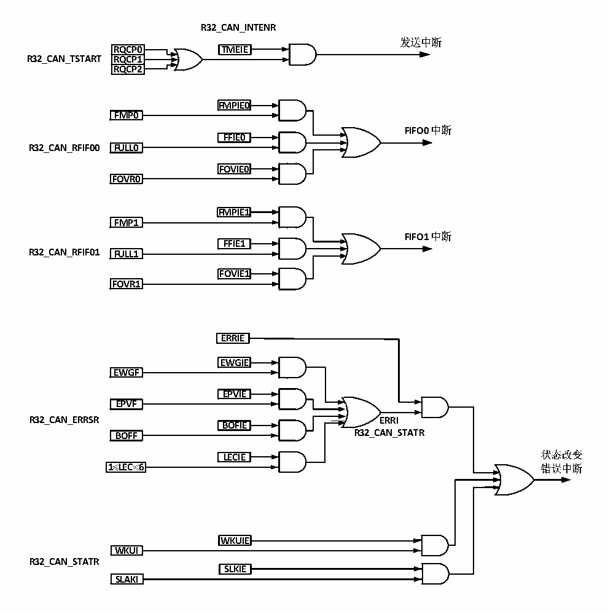

<!-- source-page: 251 -->

[← p.250](0250.md) · [index](../README.md) · [PDF p.251](https://ch32-riscv-ug.github.io/CH32V103/datasheet_zh/CH32xRM.PDF#page=251) · [p.252 →](0252.md)

<!-- header: CH32x103应用手册 https://wch.cn -->
的FMP1、FULL1和FOVER1位来判断是哪个邮箱变空事件产生。  
错误及状态变化中断由出错、唤醒和睡眠事件产生。  

图22-9 CAN中断逻辑图  
 <!-- rendered from the PDF; verify at https://ch32-riscv-ug.github.io/CH32V103/datasheet_zh/CH32xRM.PDF#page=251 -->

🖼 Text parsed from the figure above

<strong>R32_CAN_INTENR</strong>  
<!-- image: p251-draw-image-00008 inside the figure -->
RQCP0  RRQQCCPP01RQCP2  RRQQCCPP12  
<strong>RQCP0 TMEIE</strong>  
<strong>R32_CAN_TSTART RQCP1</strong>  
<strong>FMPIE0</strong>  
<strong>FMP0</strong>  
<!-- image: p251-draw-image-00009 inside the figure -->
<strong>FIFO0</strong>  
<strong>FFIE0</strong>  
<strong>R32_CAN_RFIF00 FULL0</strong>  
<strong>FOVIE0</strong>  
<strong>FOVR0</strong>  
<strong>FMPIE1</strong>  
<strong>FMP1</strong>  
<!-- image: p251-draw-image-00010 inside the figure -->
<strong>FIFO1</strong>  
<strong>FFIE1</strong>  
<strong>R32_CAN_RFIF01 FULL1</strong>  
<strong>FOVIE1</strong>  
<strong>FOVR1</strong>  
<strong>ERRIE</strong>  
<strong>EWGIE</strong>  
<strong>EWGF</strong>  
<!-- image: p251-draw-image-00005 inside the figure -->
<strong>EPVIE</strong>  
<strong>EPVF</strong>  
<!-- image: p251-draw-image-00004 inside the figure -->
<strong>R32_CAN_ERRSR ERRI</strong>  
<!-- image: p251-draw-image-00006 inside the figure -->
<strong>BOFIE</strong>  
<!-- image: p251-draw-image-00007 inside the figure -->
<strong>BOFF R32_CAN_STATR</strong>  
<!-- image: p251-draw-image-00011 inside the figure -->
LECIE  
<strong>1 LEC 6</strong>  
<!-- image: p251-draw-image-00012 inside the figure -->
<!-- image: p251-draw-image-00002 inside the figure -->
<!-- image: p251-draw-image-00003 inside the figure -->
<strong>WKUIE</strong>  
<strong>WKUI</strong>  
<strong>R32_CAN_STATR</strong>  
<strong>SLKIE</strong>  
<strong>SLAKI</strong>  

## 22.6 寄存器描述

CAN控制器相关的寄存器必须用32位字的方式来操作且操作时必须确保CAN的外设时钟已使能。  
为了避免当前节点对整个 CAN 总线的影响，所以应用软件只能在初始化模式下修改位时序寄存器  
CAN_BTIMR。  

<!-- p251-table-004 (table-22-5@1) pages 251-252 -->
<table><caption>表22-5 CAN相关寄存器列表</caption><tr><th>名称</th><th>访问地址</th><th>描述</th><th>复位值</th></tr><tr><td>R32_CAN_CTLR</td><td>0x40006400</td><td>CAN主控制寄存器</td><td>0x00010002</td></tr><tr><td>R32_CAN_STATR</td><td>0x40006404</td><td>CAN主状态寄存器</td><td>0x00000C02</td></tr><tr><td>R32_CAN_TSTATR</td><td>0x40006408</td><td>CAN发送状态寄存器</td><td>0x1C000000</td></tr><tr><td>R32_CAN_RFIFO0</td><td>0x4000640C</td><td>CAN接收FIFO0控制和状态寄存器</td><td>0x00000000</td></tr><tr><td>R32_CAN_RFIFO1</td><td>0x40006410</td><td>CAN接收FIFO1控制和状态寄存器</td><td>0x00000000</td></tr><tr><td>R32_CAN_INTENR</td><td>0x40006414</td><td>CAN中断使能寄存器</td><td>0x00000000</td></tr><tr><td>R32_CAN_ERRSR</td><td>0x40006418</td><td>CAN错误状态寄存器</td><td>0x00000000</td></tr><tr><td>R32_CAN_BTIMR</td><td>0x4000641C</td><td>CAN位时序寄存器</td><td>0x01230000</td></tr><tr><td>R32_CAN_TTCTLR</td><td>0x40006420</td><td>CAN时间触发控制寄存器</td><td>0x0000FFFF</td></tr><tr><td>R32_CAN_TTCNT</td><td>0x40006424</td><td>CAN时间触发计数值寄存器</td><td>0x00000000</td></tr></table>

<!-- image: p251-draw-image-00001 bbox=[507.84, 786.48, 527.52, 797.04] -->
<!-- footer: V2.0 249 -->
