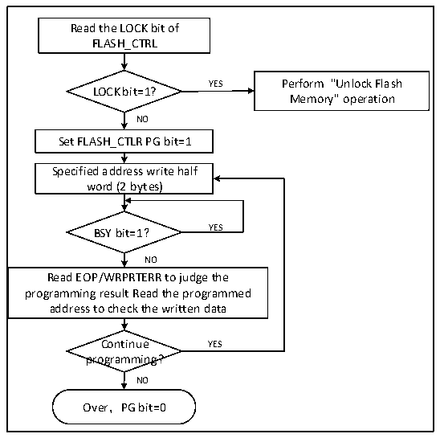

<!-- source-page: 276 -->

[← p.275](0275.md) · [index](../README.md) · [PDF p.276](https://ch32-riscv-ug.github.io/CH32V103/datasheet_zh/CH32xRM.PDF#page=276) · [p.277 →](0277.md)

<!-- header: CH32x103应用手册 https://wch.cn -->

图24-1 FLASH编程  
 <!-- rendered from the PDF; verify at https://ch32-riscv-ug.github.io/CH32V103/datasheet_zh/CH32xRM.PDF#page=276 -->

🖼 Text parsed from the figure above

Read the LOCK bit of  
FLASH_CTRL  
YES Perform &quot;Unlock Flash  
LOCK bit=1?  
Memory&quot; operation  
NO  
Set FLASH_CTLR PG bit=1  
Specified address write half  
word (2 bytes)  
BSY bit=1？ YES  
NO  
Read EOP/WRPRTERR to judge the  
programming result Read the programmed  
address to check the written data  
Continue YES  
programming?  
NO  
Over，PG bit=0  

1）检查FLASH_CTLR寄存器LOCK，如果为1，需要执行“解除闪存锁”操作。  
2）设置FLASH_CTLR寄存器的PG位为‘1’，开启标准编程模式。  
3）向指定闪存地址（偶地址）写入要编程的半字。  
4）等待BYS位变为‘0’或FLASH_STATR寄存器的EOP位为‘1’表示编程结束，将EOP位清0。  
5）查询FLASH_STATR寄存器看是否有错误，或者读编程地址数据校验。  
6）继续编程可以重复3-5步骤，结束编程将PG位清0。  

### 24.4.4 主存储器标准擦除

闪存可以按标准页（1K字节）擦除，也可以整片擦除。  
<!-- image: p276-draw-image-00001 bbox=[507.84, 786.48, 527.52, 797.04] -->
<!-- footer: V2.0 274 -->
