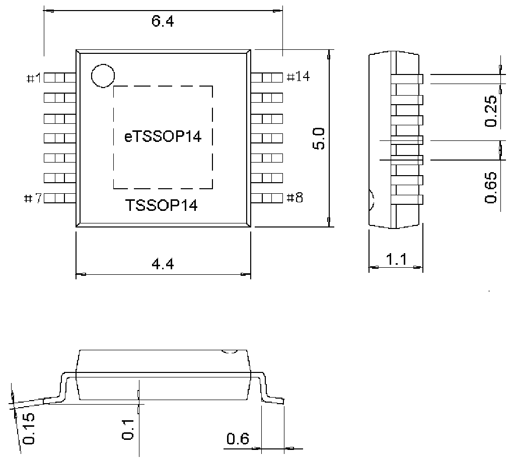

<!-- source-page: 31 -->

[← p.30](0030.md) · [index](../README.md) · [PDF p.31](https://ch32-riscv-ug.github.io/WCH-common/datasheet_en/PACKAGE.PDF#page=31) · [p.32 →](0032.md)

<!-- header: Common Package Dimensions https://wch-ic.com -->

# . TSSOP14, eTSSOP14

eTSSOP14 Exposed Pad: 3.0*3.0  

 <!-- p31-draw-image-00002 rendered from the PDF -->

<!-- image: p31-draw-image-00001 bbox=[519.12, 784.08, 538.56, 794.28] -->
<!-- footer: V4.0 31 -->
