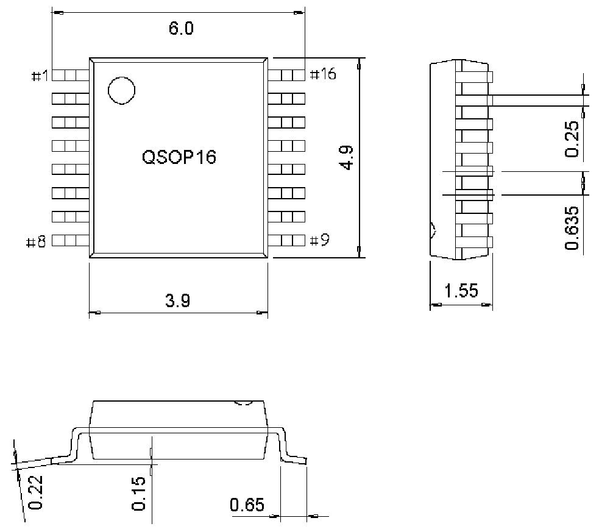

<!-- source-page: 36 -->

[← p.35](0035.md) · [index](../README.md) · [PDF p.36](https://ch32-riscv-ug.github.io/WCH-common/datasheet_en/PACKAGE.PDF#page=36) · [p.37 →](0037.md)

<!-- header: Common Package Dimensions https://wch-ic.com -->
<strong>QSOP Type (3.9mm, 150mil)(SSOP-150)</strong>  
<strong>. QSOP16 (SSOP16-150mil-0.635)</strong>  

 <!-- p36-draw-image-00002 rendered from the PDF -->

<!-- image: p36-draw-image-00001 bbox=[519.12, 784.08, 538.56, 794.28] -->
<!-- footer: V4.0 36 -->
