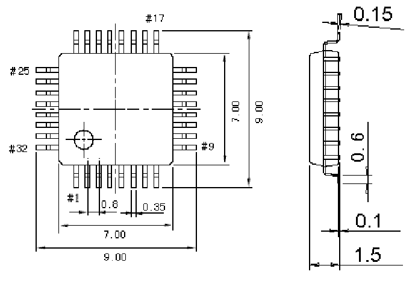

<!-- source-page: 44 -->

[← p.43](0043.md) · [index](../README.md) · [PDF p.44](https://ch32-riscv-ug.github.io/WCH-common/datasheet_en/PACKAGE.PDF#page=44) · [p.45 →](0045.md)

<!-- header: Common Package Dimensions https://wch-ic.com -->

# . LQFP32 (LQFP32-7*7)

 <!-- p44-draw-image-00002 rendered from the PDF -->

<!-- image: p44-draw-image-00001 bbox=[519.12, 784.08, 538.56, 794.28] -->
<!-- footer: V4.0 44 -->
