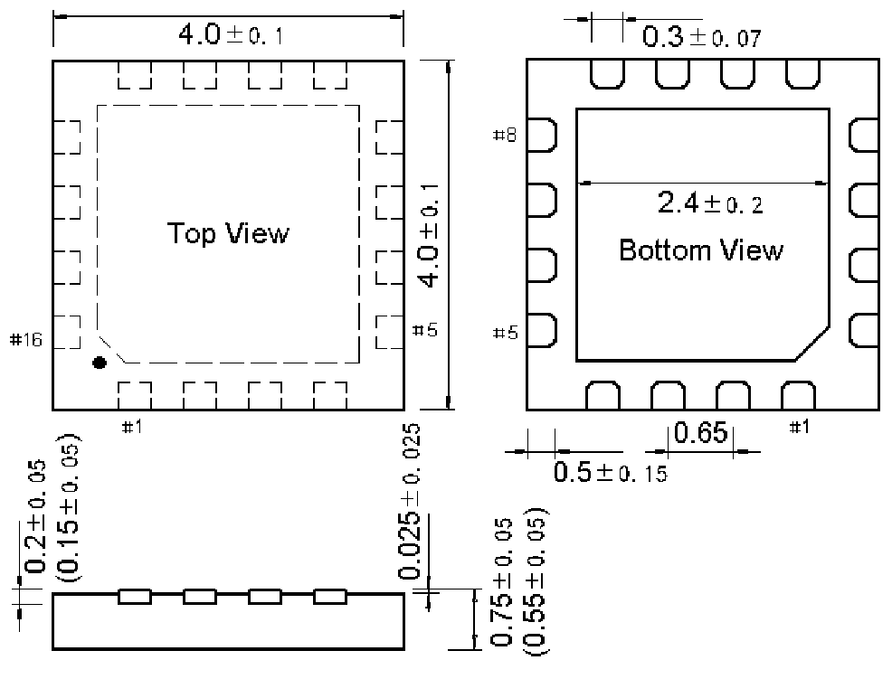

<!-- source-page: 63 -->

[← p.62](0062.md) · [index](../README.md) · [PDF p.63](https://ch32-riscv-ug.github.io/WCH-common/datasheet_en/PACKAGE.PDF#page=63) · [p.64 →](0064.md)

<!-- header: Common Package Dimensions https://wch-ic.com -->

# . QFN16X4 (QFN16-4*4-0.65)

 <!-- p63-draw-image-00002 rendered from the PDF -->

<!-- image: p63-draw-image-00001 bbox=[519.12, 784.08, 538.56, 794.28] -->
<!-- footer: V4.0 63 -->
