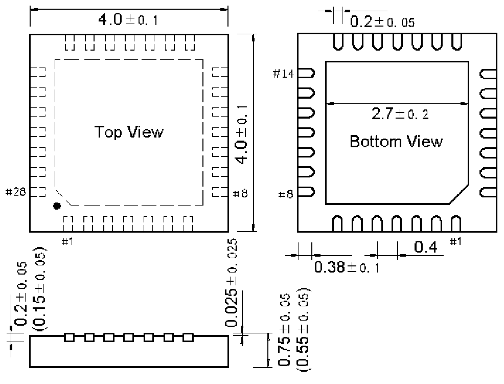

<!-- source-page: 75 -->

[← p.74](0074.md) · [index](../README.md) · [PDF p.75](https://ch32-riscv-ug.github.io/WCH-common/datasheet_en/PACKAGE.PDF#page=75) · [p.76 →](0076.md)

<!-- header: Common Package Dimensions https://wch-ic.com -->

# . QFN28 (QFN28-4*4-0.4)

 <!-- p75-draw-image-00002 rendered from the PDF -->

<!-- image: p75-draw-image-00001 bbox=[519.12, 784.08, 538.56, 794.28] -->
<!-- footer: V4.0 75 -->
