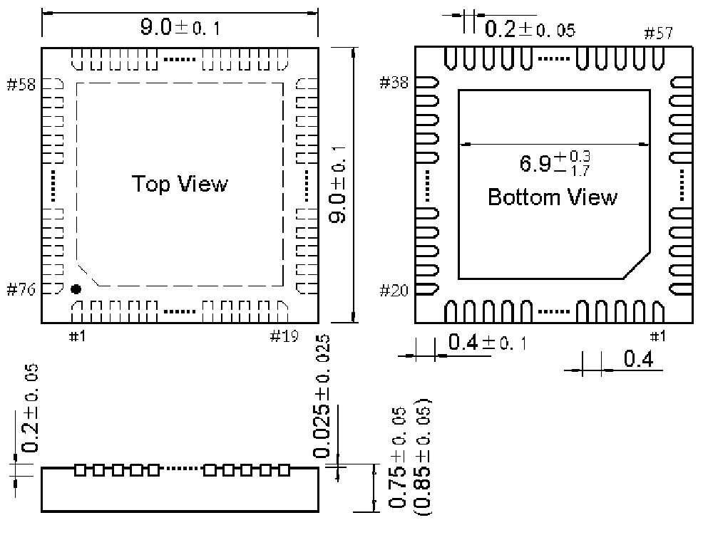

<!-- source-page: 103 -->

[← p.102](0102.md) · [index](../README.md) · [PDF p.103](https://ch32-riscv-ug.github.io/WCH-common/datasheet_en/PACKAGE.PDF#page=103) · [p.104 →](0104.md)

<!-- header: Common Package Dimensions https://wch-ic.com -->

# . QFN76 (QFN76-9*9-0.4)

 <!-- p103-draw-image-00002 rendered from the PDF -->

<!-- image: p103-draw-image-00001 bbox=[519.12, 784.08, 538.56, 794.28] -->
<!-- footer: V4.0 103 -->
