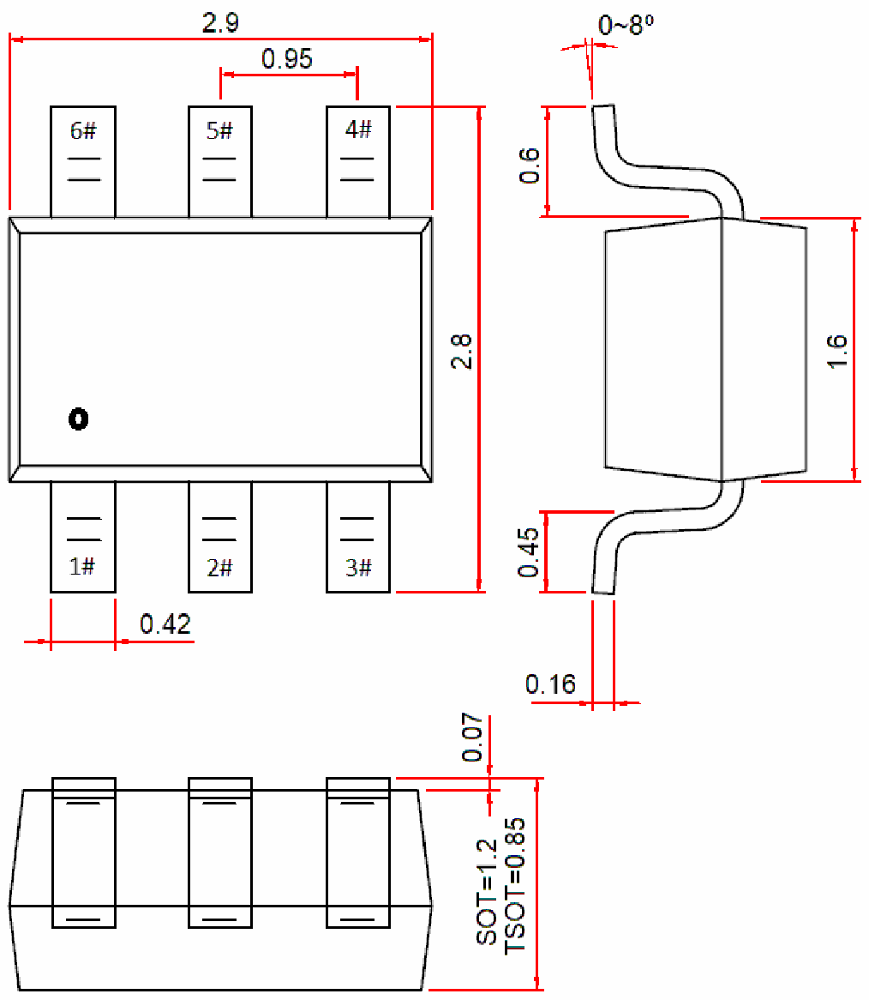

<!-- source-page: 116 -->

[← p.115](0115.md) · [index](../README.md) · [PDF p.116](https://ch32-riscv-ug.github.io/WCH-common/datasheet_en/PACKAGE.PDF#page=116) · [p.117 →](0117.md)

<!-- header: Common Package Dimensions https://wch-ic.com -->

# . SOT23-6, TSOT23-6L, SOT26

 <!-- p116-draw-image-00002 rendered from the PDF -->

<!-- image: p116-draw-image-00001 bbox=[519.12, 784.08, 538.56, 794.28] -->
<!-- footer: V4.0 116 -->
