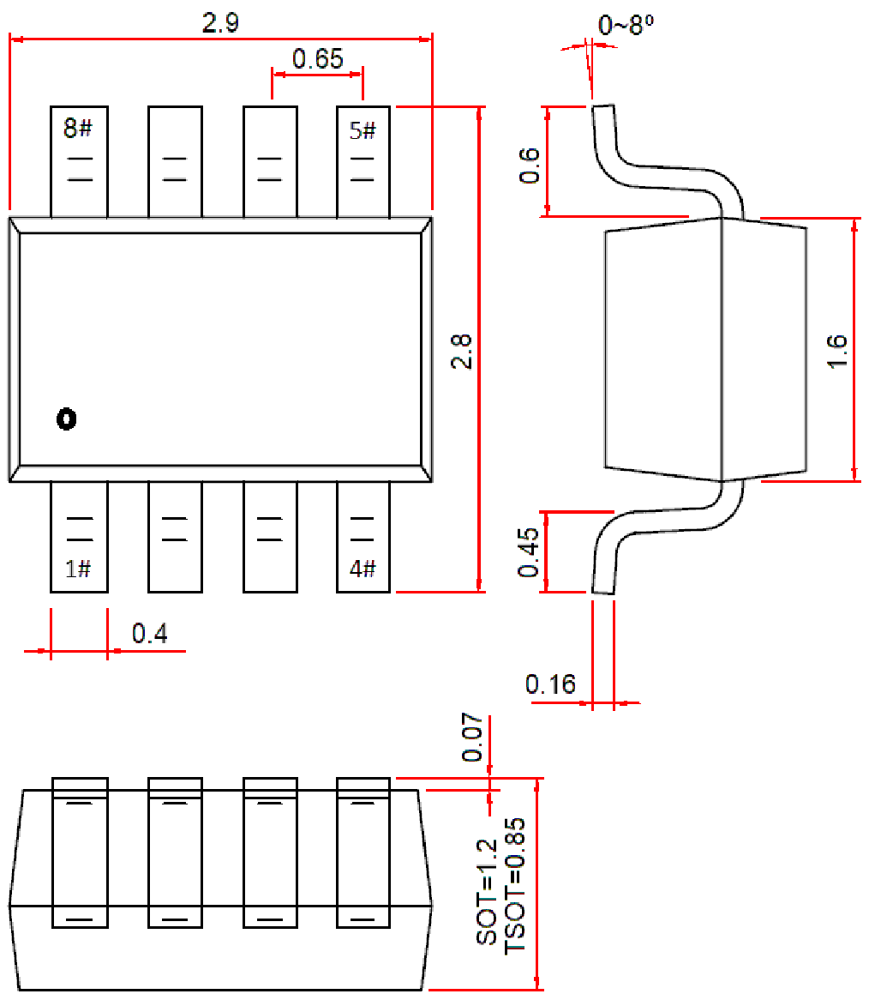

<!-- source-page: 117 -->

[← p.116](0116.md) · [index](../README.md) · [PDF p.117](https://ch32-riscv-ug.github.io/WCH-common/datasheet_en/PACKAGE.PDF#page=117) · [p.118 →](0118.md)

<!-- header: Common Package Dimensions https://wch-ic.com -->

# . SOT23-8, TSOT23-8L, SOT28

 <!-- p117-draw-image-00002 rendered from the PDF -->

<!-- image: p117-draw-image-00001 bbox=[519.12, 784.08, 538.56, 794.28] -->
<!-- footer: V4.0 117 -->
