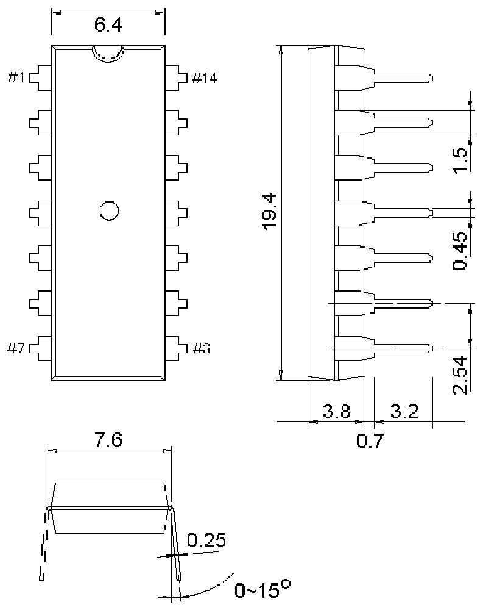

<!-- source-page: 5 -->

[← p.4](0004.md) · [index](../README.md) · [PDF p.5](https://ch32-riscv-ug.github.io/WCH-common/datasheet_zh/PACKAGE.PDF#page=5) · [p.6 →](0006.md)

<!-- header: 常用封装尺寸 ５ https://wch.cn -->
. DIP14  

 <!-- p5-draw-image-00001 rendered from the PDF -->
