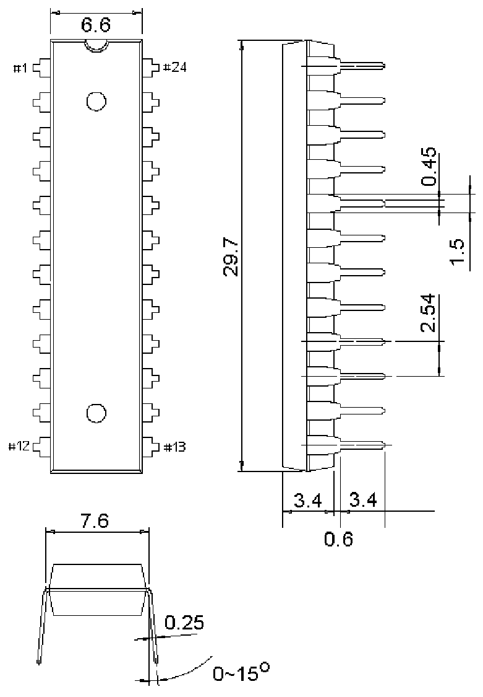

<!-- source-page: 9 -->

[← p.8](0008.md) · [index](../README.md) · [PDF p.9](https://ch32-riscv-ug.github.io/WCH-common/datasheet_zh/PACKAGE.PDF#page=9) · [p.10 →](0010.md)

<!-- header: 常用封装尺寸 ９ https://wch.cn -->
. DIP24S（SKDIP24、DIP24-300mil）  

 <!-- p9-draw-image-00001 rendered from the PDF -->
