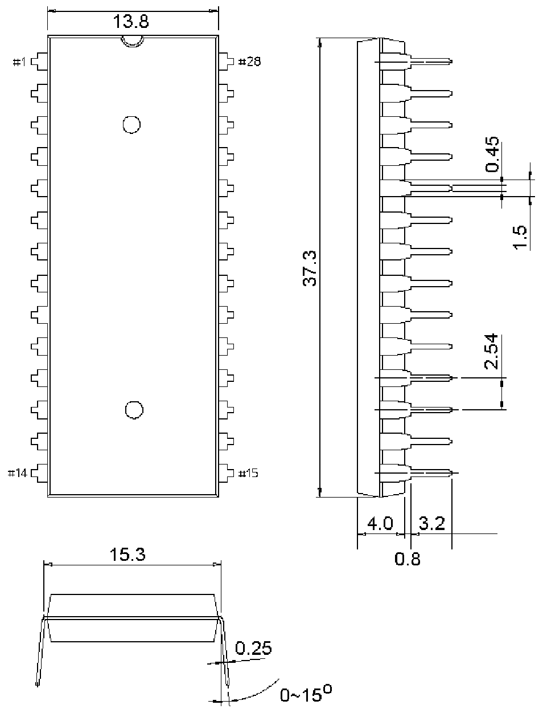

<!-- source-page: 11 -->

[← p.10](0010.md) · [index](../README.md) · [PDF p.11](https://ch32-riscv-ug.github.io/WCH-common/datasheet_zh/PACKAGE.PDF#page=11) · [p.12 →](0012.md)

<!-- header: 常用封装尺寸 １１ https://wch.cn -->
. DIP28（DIP28W、DIP28-600mil）  

 <!-- p11-draw-image-00001 rendered from the PDF -->
