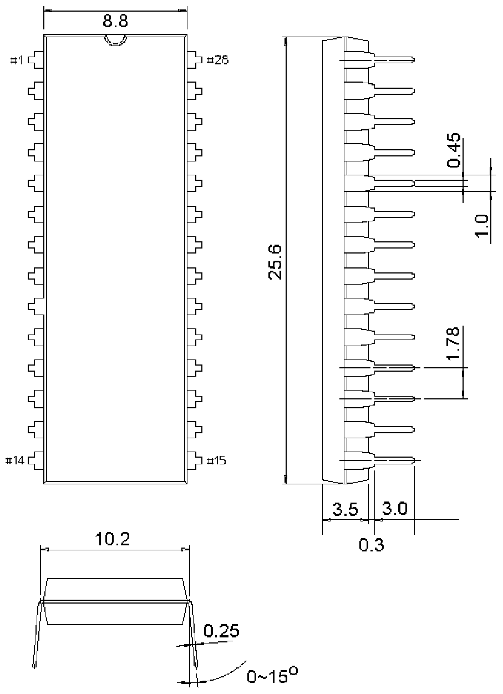

<!-- source-page: 12 -->

[← p.11](0011.md) · [index](../README.md) · [PDF p.12](https://ch32-riscv-ug.github.io/WCH-common/datasheet_zh/PACKAGE.PDF#page=12) · [p.13 →](0013.md)

<!-- header: 常用封装尺寸 １２ https://wch.cn -->
. SDIP28（SDIP28-400mil）  

 <!-- p12-draw-image-00001 rendered from the PDF -->
