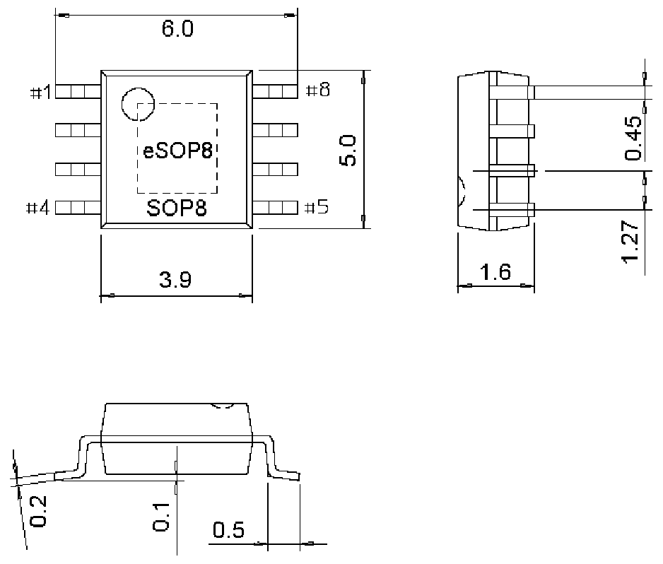

<!-- source-page: 14 -->

[← p.13](0013.md) · [index](../README.md) · [PDF p.14](https://ch32-riscv-ug.github.io/WCH-common/datasheet_zh/PACKAGE.PDF#page=14) · [p.15 →](0015.md)

<!-- header: 常用封装尺寸 １４ https://wch.cn -->

# SOP 类（SOIC）

. SOP8、eSOP8  
eSOP8 Exposed Pad：2.1*3.3、2.1*2.1  

 <!-- p14-draw-image-00001 rendered from the PDF -->
