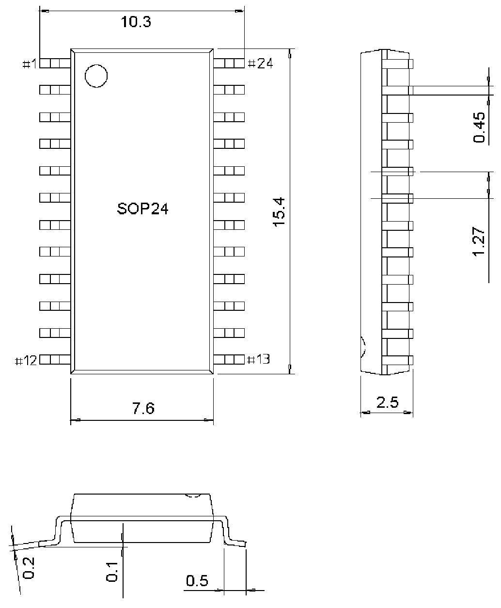

<!-- source-page: 19 -->

[← p.18](0018.md) · [index](../README.md) · [PDF p.19](https://ch32-riscv-ug.github.io/WCH-common/datasheet_zh/PACKAGE.PDF#page=19) · [p.20 →](0020.md)

<!-- header: 常用封装尺寸 １９ https://wch.cn -->
. SOP24  

 <!-- p19-draw-image-00001 rendered from the PDF -->
