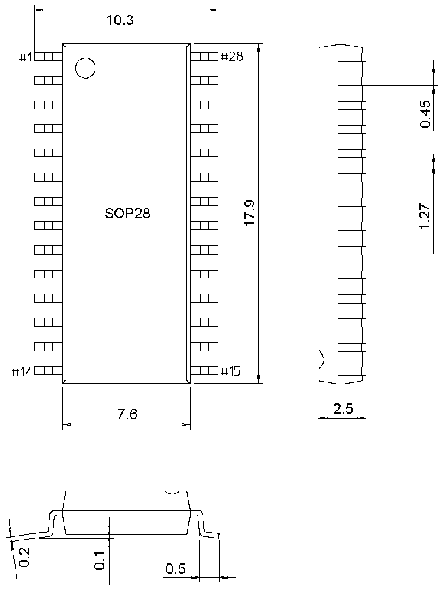

<!-- source-page: 20 -->

[← p.19](0019.md) · [index](../README.md) · [PDF p.20](https://ch32-riscv-ug.github.io/WCH-common/datasheet_zh/PACKAGE.PDF#page=20) · [p.21 →](0021.md)

<!-- header: 常用封装尺寸 ２０ https://wch.cn -->
. SOP28  

 <!-- p20-draw-image-00001 rendered from the PDF -->
