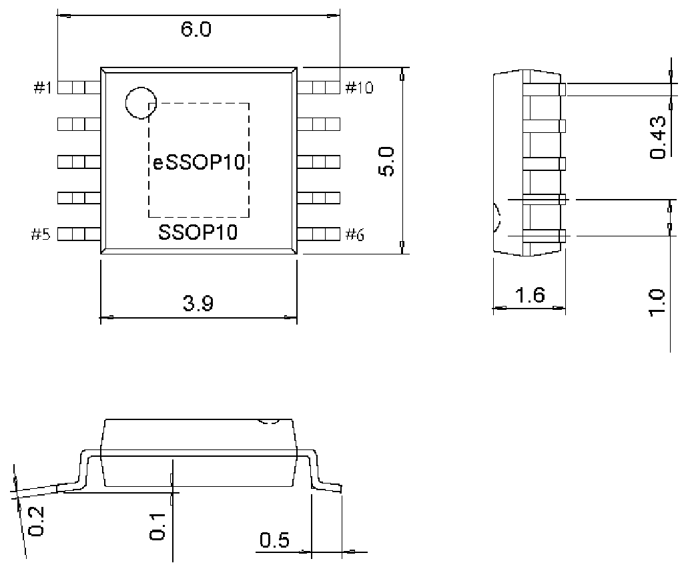

<!-- source-page: 22 -->

[← p.21](0021.md) · [index](../README.md) · [PDF p.22](https://ch32-riscv-ug.github.io/WCH-common/datasheet_zh/PACKAGE.PDF#page=22) · [p.23 →](0023.md)

<!-- header: 常用封装尺寸 ２２ https://wch.cn -->

# SSOP 类

. SSOP10（SSOP10-150mil-1.00）、eSSOP10  
eSSOP10 Exposed Pad：2.1*3.3  

 <!-- p22-draw-image-00001 rendered from the PDF -->
