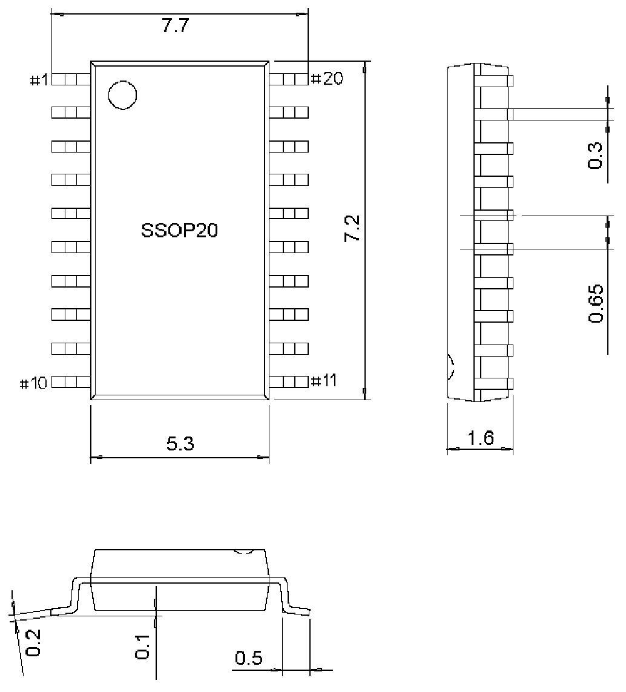

<!-- source-page: 24 -->

[← p.23](0023.md) · [index](../README.md) · [PDF p.24](https://ch32-riscv-ug.github.io/WCH-common/datasheet_zh/PACKAGE.PDF#page=24) · [p.25 →](0025.md)

<!-- header: 常用封装尺寸 ２４ https://wch.cn -->
. SSOP20（SSOP20-209mil-0.65）  

 <!-- p24-draw-image-00001 rendered from the PDF -->
