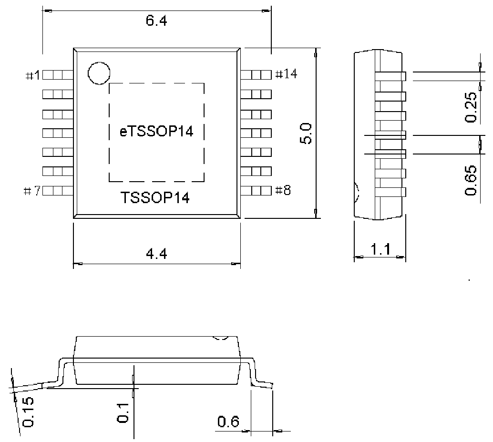

<!-- source-page: 29 -->

[← p.28](0028.md) · [index](../README.md) · [PDF p.29](https://ch32-riscv-ug.github.io/WCH-common/datasheet_zh/PACKAGE.PDF#page=29) · [p.30 →](0030.md)

<!-- header: 常用封装尺寸 ２９ https://wch.cn -->
. TSSOP14、eTSSOP14  
eTSSOP14 Exposed Pad：3.0*3.0  

 <!-- p29-draw-image-00001 rendered from the PDF -->
