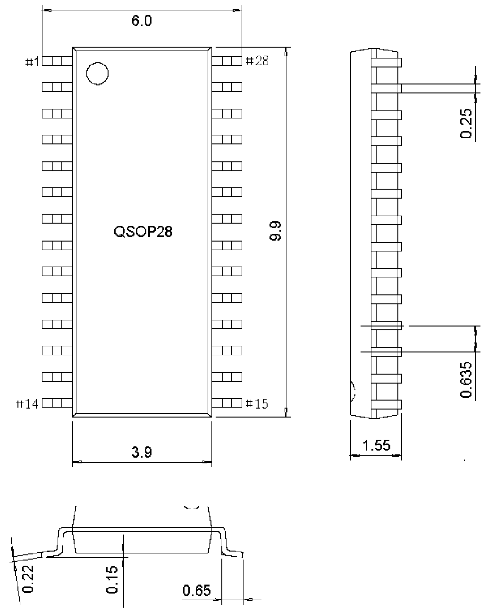

<!-- source-page: 37 -->

[← p.36](0036.md) · [index](../README.md) · [PDF p.37](https://ch32-riscv-ug.github.io/WCH-common/datasheet_zh/PACKAGE.PDF#page=37) · [p.38 →](0038.md)

<!-- header: 常用封装尺寸 ３７ https://wch.cn -->
. QSOP28（SSOP28-150mil-0.635）  

 <!-- p37-draw-image-00001 rendered from the PDF -->
