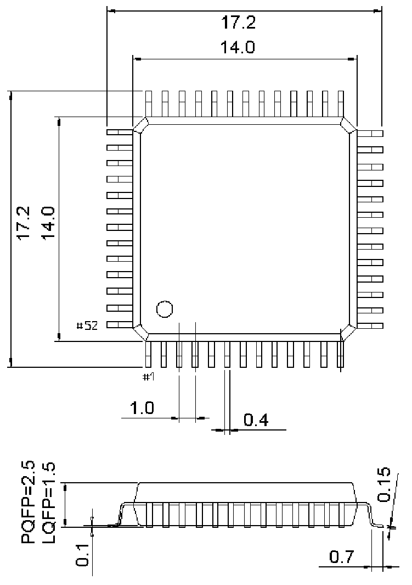

<!-- source-page: 39 -->

[← p.38](0038.md) · [index](../README.md) · [PDF p.39](https://ch32-riscv-ug.github.io/WCH-common/datasheet_zh/PACKAGE.PDF#page=39) · [p.40 →](0040.md)

<!-- header: 常用封装尺寸 ３９ https://wch.cn -->
. PQFP52（QFP52）  

 <!-- p39-draw-image-00001 rendered from the PDF -->
